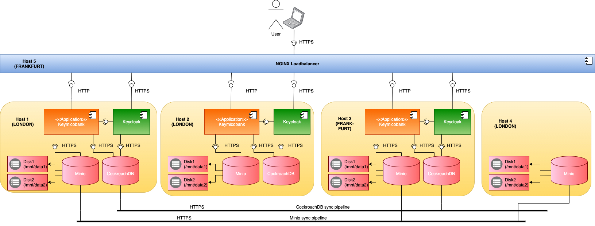
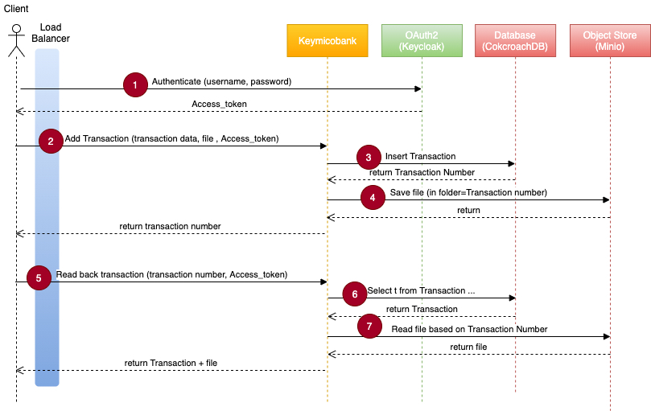
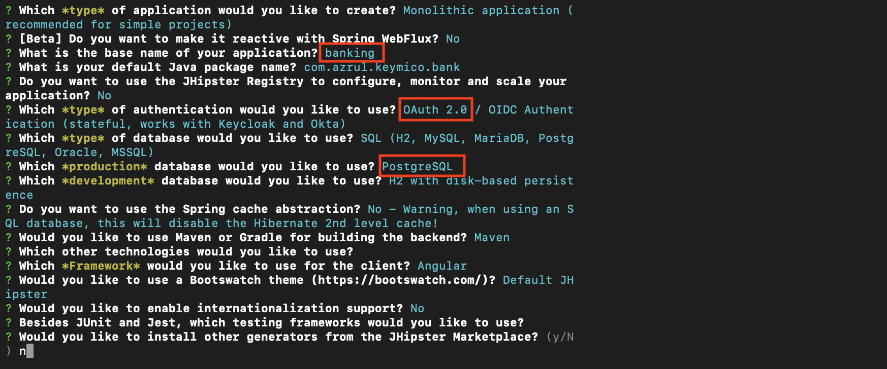
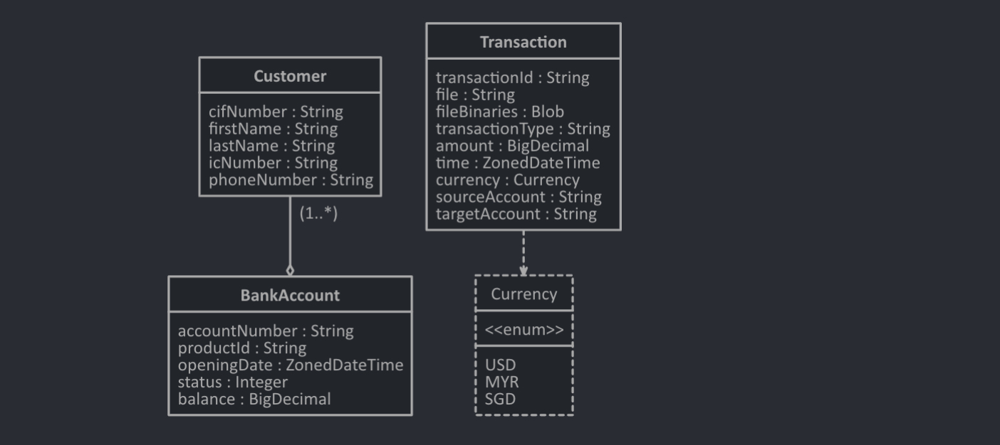
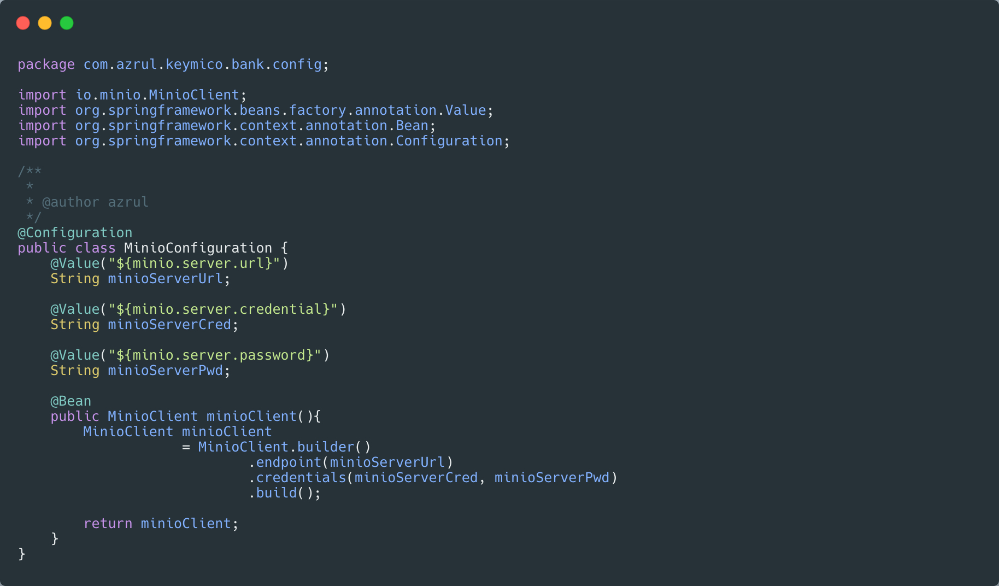
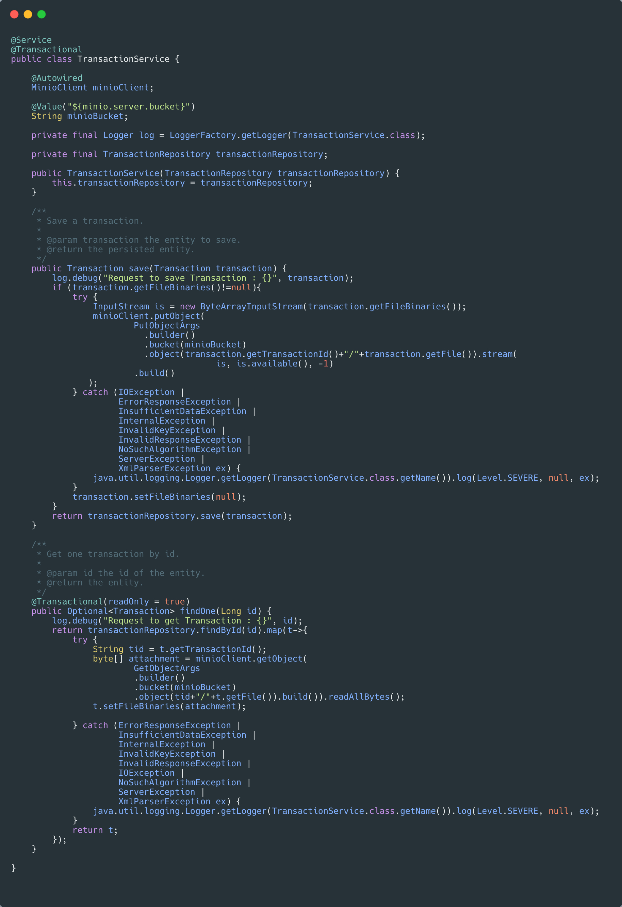
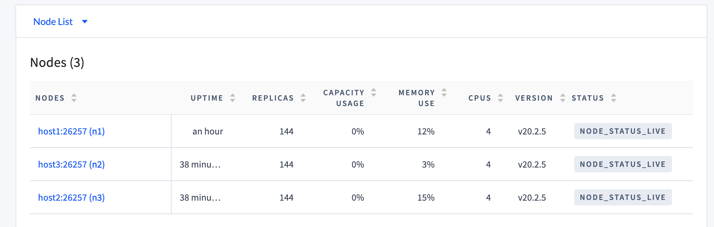
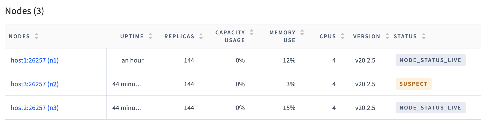
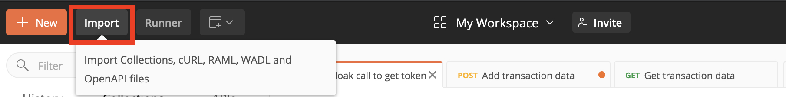

Keymico: a resilient multi-cloud stack — or how to spend your holidays in a lockdown
====================================================================================

 

It all started with a tussle between Huawei and a US startup company CNEX in
2018 - and escalated to the US banning the usage of Huawei telecom technology in
2019, to the Trump administration adding another year (until May 2021) to the
2019 Huawei ban
[<https://www.cnet.com/news/huawei-ban-full-timeline-us-sanctions-china-trump-biden-5g-phone-sales/>].
The ban is not just in the US, but also involves the EU, Canada and the UK. As a
consequence, Huawei dropped to the 5th place in the global smartphone ranking,
with the company chairman admitting that 2020 will be “difficult" for Huawei "as
the [US continues to ban devices and
equipment](https://www.cnet.com/news/huawei-ban-full-timeline-us-sanctions-china-trump-biden-5g-phone-sales/) from
the Chinese telecom giant and phone maker".

A little known fact about Huawei: they also operate as a cloud service provider
(CSP). Their cloud service is also
affected.<[https://www.taipeitimes.com/News/biz/archives/2020/10/16/2003745224>].
Quoting the article:

 

"As part of a European tour last week, US Undersecretary of State for Economic
Growth, Energy and the Environment Keith Krach met executives including Deutsche
Telekom AG CEO Timotheus Hoettges and Meinrad Spenger, the head of Spanish
telecom carrier MasMovil, to urge them to ditch Chinese vendors of cloud
infrastructure on data-security concerns."

 

Now imagine that we are a user of Huawei's cloud services - can we sleep at
night knowing our CSP could be targeted by a ban? What about our customers?
Wouldn't they be worried? Would they not move to a more reliable company - non
dependent on Huawei? This is the risk of using a single CSP.

 

 

Now some would say that their CSP is an American/European company and a ban like
this would never happen. Well, maybe not a ban, but big tech companies are known
to abandon (or threaten to abandon ) a particular market all the time. Google
exited China, Uber exited South East Asia, both Google and Facebook threaten to
pull out of Australia due to a spat about about paying local news outlet their
fair due.

 

Apart from global politics, technology lock in is another risk of using only one
CSP. So we coded our business logic as a serverless component on AWS, want to
move that to Azure - well, you will have to do some work. Another aspect of lock
in is data. Even if we are using standard base technology (such as a SQL
compatible database) - it will still take a huge time to transfers terabytes of
data from one CSP to another - such that, we are locked in by one CSP because
moving data is just too costly and take too long. Not having a choice means, you
might need to compete with your own CSP. Take Netflix for example - a loyal user
of Amazon Web Services. And yet, Amazon also has its own streaming service
(Amazon Prime) rivalling Netflix. In my opinion, that would not have been a
comfortable thing for Netflix, having to be dependent on their competitor!

 

How would you mitigate all these risks? Multi-cloud architecture is the answer.
*"Multicloud* architectures, in which multiple services are hosted by different
cloud providers, are the most common deployment"
[<https://www.oreilly.com/library/view/multicloud-architecture-migration/9781492050407/ch01.html>].
**In a multi-cloud architecture, if one CSP is out, you can always seamlessly
fallback to another**. The challenge of multi-cloud architecture is obvious, we
cannot leverage CSP specific cloud technology- as this would tie us to that
specific CSP only. So we have to find a neutral way (open source, third party or
standard) to go about multi-cloud - enter the Keymico stack.

 

In this article, we will introduce the Keymico stack. We will run through a test
environment where the stack is well… stacked up, and we will then simulate a
failure and see how resilient is this stack.

 

 

The Keymico stack
-----------------

### Introduction

Keymico (Keycloak-Minio-CockroahDB) is a cloud neutral open source stack made of
3 software package that allows us to fulfil:

**Relational database function:** CockroachDB

**Object storage function:** Minio

**Identity broker/management function:** Keycloak

In this article we will introduce this stack. We will look into how to set them
up and how to test their resiliency across multi availability zone (AZ)
deployment.

 

(These 3 functionalities are what I usually use cloud for - definitely it does
not cover every possible use case out there [no A.I. service for example]. Of
course, I am thinking of extension - e.g. Vault to help manage certificates and
security, Kafka for resilient messaging , Consul for networking etc. - so maybe
a Keymico+ stack in the future)

 

### Only for cloud?

The great thing about the Keymico stack is that it doesn’t have to be cloud. If
all you have is a bunch of VMs connected to the internet (and a CDN) you can
quickly setup a super resilient cloud-like infra-structure - even for on premise
applications. This is especially true for people working in sensitive or
regulated industry such as the military, financial services or even health.

 

### Alternative

An alternative to this stack is the full force Open Stack
[<https://www.openstack.org/>]. I, personally, find Open Stack to be very
complete - and maybe that is why it seems a tad overwhelming to setup. Then
again, I would love to see a comparison between Open Stack and Keymico just for
the heck of it :)

 

Archictecture
-------------

In this article we will use a simple banking restful application (called
Keymicobank) that will be distributed to 3 VMs spread among 2 AZs.

-   In this architecture, we will setup Minio, Keycloak and CockroachDB in 3 VMs
    in 2 different AZs. Minio will have a 4th VM in accordance to its minimal
    requirement

-   This is a test setup, so we mix everything together in a single VM (DB,
    identity, application). In a production environment, you may want to
    separate your data and identity into different layers. And you may want to
    load-balance traffic per layer.

-   Both CockhroachDB and Minio are sync across AZs so that data loss is
    minimised

-   We also mounted two disks per setup for Minio to use.

-   Keycloak is not setup as a cluster. Despite that, given that Keycloak’s
    database is highly available, Keycloak access is maintained even in the
    incident of an AZ failure.

-   All Keymico services are secured using self-signed TLS certificates. The
    application's (i.e. Keymico bank’s) services are secured at the Nginx load
    balancer level - also with a self-signed certificate

-   We emulate a CDN using an Nginx load balancer. Of course, in this test
    setup, if the single node load balancer fails then the whole setup fails. In
    reality, we would highly encourage the usage of a proper CDN.

-   The Nginx load balancer is configured to round robin the requests to the
    applications. No session stickiness is expected as we assume data would
    always be sync between the database/object store nodes. In case of failure,
    Nginx will count the error up to maximum threshold, once exceeded, the
    server is considered unavailable and taken offline for an hour before retry.

 

Getting our hands dirty - Preliminary environment setup
-------------------------------------------------------

### What do we need

-   We would need 4 or 5 VMs, if possible, internet facing for full effect (the
    VMs can be on a LAN, but, depending on your setup, you might not see the
    effect of multi-AZ failure test we are doing later)

    1.  3 VMs for our application + Keymico stack

    2.  1 VM for Minio alone

    3.  1 VM for NGINX

    4.  Optionally, 1 VM for Jmeter to perform performance test (we can also run
        Jmeter on our laptop if we want)

-   Most of these commands should be the same across the VMs, so a tool like
    Ansible would definitely help. We will stick with plain bash for this
    article

-   Our VMs are Ubuntu based and therefore we will use Ubuntu specific command
    such as apt-get. You may want to find the equivalent command in your
    favourite OS

-   We will name (hostname) our VMs host1, host2, host3, host4 and host5. We
    will use plain old /etc/hosts for this. In a production environment, you may
    want to use proper DNS. We will put host1, host2 and host4 in the same AZ
    and host3 and host5 in a different AZ all together. Please make sure that
    they can communicate with each other.

-   We will mount 2 disks per node for Minio to use. We name the disks data1 and
    data2 The disks are mounted on /mnt/data1 and /mnt/data2

-   We will also need SSH access to all hosts.

 

### Users for Host1, Host2 and Host3

Create users (notice the command to create user has a space in front of `sudo`
so that the command is not stored in bash history - you do not want people to
see the password by looking at history. Another - less automatable - option is
to take out `-p` and you will be prompted for a password):

-   cockroach

    ~~~~~~~~~~~~~~~~~~~~~~~~~~~~~~~~~~~~~~~~~~~~~~~~~~~~~~~~~~~~~~~~~~~~~~~~~~~~
    >  sudo useradd -m -p $(openssl passwd -crypt "<some password>") cockroach -s /bin/bash
    > sudo usermod -aG sudo cockroach
    ~~~~~~~~~~~~~~~~~~~~~~~~~~~~~~~~~~~~~~~~~~~~~~~~~~~~~~~~~~~~~~~~~~~~~~~~~~~~

-   minio

    ~~~~~~~~~~~~~~~~~~~~~~~~~~~~~~~~~~~~~~~~~~~~~~~~~~~~~~~~~~~~~~~~~~~~~~~~~~~~
    >  sudo useradd -m -p $(openssl passwd -crypt "<some password>") minio -s /bin/bash
    > sudo usermod -aG sudo minio
    ~~~~~~~~~~~~~~~~~~~~~~~~~~~~~~~~~~~~~~~~~~~~~~~~~~~~~~~~~~~~~~~~~~~~~~~~~~~~

-   keycloak

    ~~~~~~~~~~~~~~~~~~~~~~~~~~~~~~~~~~~~~~~~~~~~~~~~~~~~~~~~~~~~~~~~~~~~~~~~~~~~
    >  sudo useradd -m -p $(openssl passwd -crypt "<some password>") keycloak -s /bin/bash
    > sudo usermod -aG sudo keycloak
    ~~~~~~~~~~~~~~~~~~~~~~~~~~~~~~~~~~~~~~~~~~~~~~~~~~~~~~~~~~~~~~~~~~~~~~~~~~~~

 

### Users for Host4

-   minio

    ~~~~~~~~~~~~~~~~~~~~~~~~~~~~~~~~~~~~~~~~~~~~~~~~~~~~~~~~~~~~~~~~~~~~~~~~~~~~
    >  sudo useradd -m -p $(openssl passwd -crypt "<some password>") minio -s /bin/bash
    > sudo usermod -aG sudo minio
    ~~~~~~~~~~~~~~~~~~~~~~~~~~~~~~~~~~~~~~~~~~~~~~~~~~~~~~~~~~~~~~~~~~~~~~~~~~~~

 

### User for Host 5

-   nginx

    ~~~~~~~~~~~~~~~~~~~~~~~~~~~~~~~~~~~~~~~~~~~~~~~~~~~~~~~~~~~~~~~~~~~~~~~~~~~~
    >  sudo useradd -m -p $(openssl passwd -crypt "<some password>") nginx -s /bin/bash
    > sudo usermod -aG sudo nginx
    ~~~~~~~~~~~~~~~~~~~~~~~~~~~~~~~~~~~~~~~~~~~~~~~~~~~~~~~~~~~~~~~~~~~~~~~~~~~~

 

 

### Directory structure for Host1, Host2 and Host3

-   /opt : This is where we put Keycloak’s, Minio’s, CockroachDB’s and
    application's binary files

-   /mnt/disk1: Minio mounted disk1.

-   /mnt/disk2: Minio mounted disk2.

-   /workingdir: Working directory where we will first upload our files

-   /home/cockroach: Cockroach user home directory

-   /home/cockroach/certs: Cockroach DB certificates directory

-   /home/cockroach/my-safe-directory: Cockroach DB CA key directory

-   /home/minio: Minio user home directory

-   /home/minio/.minio/certs: Minio’s host certificate directory

-   /home/minio/.minio/certs/CAs: Minio’s certificate directory for all the
    other hosts

-   /home/keycloak: Keycloak user home directory

 

### Directory structure for Host4

-   /opt : This is where we put Minio’s binary files

-   /mnt/data1: Minio mounted disk \#1.

-   /mnt/data2: Minio mounted disk \#2.

-   /workingdir: Working directory

-   /home/minio: Minio user home directory

-   /home/minio/.minio/certs: Minio’s host certificate directory

-   /home/minio/.minio/certs/CAs: Minio’s certificate directory for all the
    other hosts

 

### Directory structure for Host5

-   /workingdir: Working directory

 

### Outgoing ports open for all hosts

-   All ports

 

### Incoming ports open for Host1, Host2 and Host3

-   8080: CockroachDB admin portal

-   9000: Minio service port and admin portal

-   9443: Keycloak HTTPS service and admin portal

-   18080: Application service port

-   26257: CockroachDB service port

 

### Incoming ports open for Host4

-   9000: Minio service port and admin portal

 

### Incoming ports open for Host5

-   8443: NGINX HTTPS service port

 

### Host mapping for Host1, Host2 and Host3

-   Before we do this please note down the IP addresses (external facing) of
    Host1, Host2, Host3 and Host4

-   Open up the /etc/hosts file

~~~~~~~~~~~~~~~~~~~~~~~~~~~~~~~~~~~~~~~~~~~~~~~~~~~~~~~~~~~~~~~~~~~~~~~~~~~~~~~~
> sudo /etc/hosts
~~~~~~~~~~~~~~~~~~~~~~~~~~~~~~~~~~~~~~~~~~~~~~~~~~~~~~~~~~~~~~~~~~~~~~~~~~~~~~~~

-   Add the entries below

~~~~~~~~~~~~~~~~~~~~~~~~~~~~~~~~~~~~~~~~~~~~~~~~~~~~~~~~~~~~~~~~~~~~~~~~~~~~~~~~
<host4 ip address> host4
<host3 ip address> host3
<host2 ip address> host2
<host1 ip address> host1
127.0.0.1 keycloak
~~~~~~~~~~~~~~~~~~~~~~~~~~~~~~~~~~~~~~~~~~~~~~~~~~~~~~~~~~~~~~~~~~~~~~~~~~~~~~~~

-   Why is keycloak pointing to 127.0.0.1? We will explain that later

-   Alternatively, we can also use a DNS for all these entries

 

### Host mapping for Host4

-   Host4 has no Keycloak, the configuration is just a little bit different

-   Open up the /etc/hosts file

~~~~~~~~~~~~~~~~~~~~~~~~~~~~~~~~~~~~~~~~~~~~~~~~~~~~~~~~~~~~~~~~~~~~~~~~~~~~~~~~
> sudo /etc/hosts
~~~~~~~~~~~~~~~~~~~~~~~~~~~~~~~~~~~~~~~~~~~~~~~~~~~~~~~~~~~~~~~~~~~~~~~~~~~~~~~~

-   Add the entries below

~~~~~~~~~~~~~~~~~~~~~~~~~~~~~~~~~~~~~~~~~~~~~~~~~~~~~~~~~~~~~~~~~~~~~~~~~~~~~~~~
<host4 ip address> host4
<host3 ip address> host3
<host2 ip address> host2
<host1 ip address> host1
~~~~~~~~~~~~~~~~~~~~~~~~~~~~~~~~~~~~~~~~~~~~~~~~~~~~~~~~~~~~~~~~~~~~~~~~~~~~~~~~

-   Alternatively, we can also use a DNS for all these entries

 

### Host mapping for host5

-   Open up the /etc/hosts file

~~~~~~~~~~~~~~~~~~~~~~~~~~~~~~~~~~~~~~~~~~~~~~~~~~~~~~~~~~~~~~~~~~~~~~~~~~~~~~~~
> sudo /etc/hosts
~~~~~~~~~~~~~~~~~~~~~~~~~~~~~~~~~~~~~~~~~~~~~~~~~~~~~~~~~~~~~~~~~~~~~~~~~~~~~~~~

-   Add the entries below.

~~~~~~~~~~~~~~~~~~~~~~~~~~~~~~~~~~~~~~~~~~~~~~~~~~~~~~~~~~~~~~~~~~~~~~~~~~~~~~~~
<host4 ip address> host4
~~~~~~~~~~~~~~~~~~~~~~~~~~~~~~~~~~~~~~~~~~~~~~~~~~~~~~~~~~~~~~~~~~~~~~~~~~~~~~~~

-   Alternatively, we can also use a DNS for all these entries

 

### Host mapping on our laptop

-   If we are running our tests on a laptop, we would need certain mapping

-   Open up the /etc/hosts file

~~~~~~~~~~~~~~~~~~~~~~~~~~~~~~~~~~~~~~~~~~~~~~~~~~~~~~~~~~~~~~~~~~~~~~~~~~~~~~~~
> sudo /etc/hosts
~~~~~~~~~~~~~~~~~~~~~~~~~~~~~~~~~~~~~~~~~~~~~~~~~~~~~~~~~~~~~~~~~~~~~~~~~~~~~~~~

-   Add the entries below. Please note both keycloak and host4 point to host4 ip
    address.

~~~~~~~~~~~~~~~~~~~~~~~~~~~~~~~~~~~~~~~~~~~~~~~~~~~~~~~~~~~~~~~~~~~~~~~~~~~~~~~~
<host5 ip address> host5
<host4 ip address> host4
<host3 ip address> host3
<host2 ip address> host2
<host1 ip address> host1
<host4 ip address> keycloak 
~~~~~~~~~~~~~~~~~~~~~~~~~~~~~~~~~~~~~~~~~~~~~~~~~~~~~~~~~~~~~~~~~~~~~~~~~~~~~~~~

-   Alternatively, we can also use a DNS for all these entries

 

Getting our hands dirty
-----------------------

We find that is it better to setup components per components across all the
servers instead of setting up server per server. This also facilitates
automation, for example, using Ansible. We will first present the environment
variables which are server specific.

 

### Password sheet

Below is the list of all the usernames need to be setup. We suggest that this
list is updated with respective passwords as we follow this article.

-   cockroach - CockroachDB UNIX user

-   minio - Minio UNIX user

-   keycloak - Keycloak UNIX user

-   root - Unix root user and CockroachDB default user

-   minio-admin - Minio admin user

-   mystoreuser - Minio system user

-   keycloak - Keycloak database user

-   banking - Banking (application) database user

-   admin - Keycloak administrator (defaulted to abc123)

-   donald.duck - Keycloak user

-   bankingclient - Keycloak’s client name - it is associated with a secret
    instead of a password

 

### Environment variables for Host1

~~~~~~~~~~~~~~~~~~~~~~~~~~~~~~~~~~~~~~~~~~~~~~~~~~~~~~~~~~~~~~~~~~~~~~~~~~~~~~~~
export CURRENT_WORKING_DIR=/workingdir
export HOST=host1
export HOST2=host2
export HOST3=host3
export HOST4=host4

#-----------COCKROACHDB ENVIRONMENT VARIABLES FOR HOST1---------------------
#---------------------------------------------------------------------------

#--Where to download CockroachDB
export COCKROACH_DOWNLOAD_URL=https://binaries.cockroachdb.com/cockroach-v20.2.5.linux-amd64.tgz

#--Name of the unzipped folder for CockroachDB
export COCKROACH_UNZIPED_DIR=cockroach-v20.2.5.linux-amd64

#--This is the CockroachDB certificate configuration. 
#--In the NODE_ACCESS_LIST, list down all possible access point to CockroachDB
export CA_CRT=ca.crt
export NODE_ACCESS_LIST="139.59.175.78 host1 localhost 127.0.0.1" #space seperated hostname/ip address used to access host1

#--CockroachDB is also available in 2 other hosts, specify their info here
#--The OTHER_NODE1_ACCESS_LIST, list down all access points to Host2's CockroachDB
#--The OTHER_NODE2_ACCESS_LIST, list down all access points to Host3's CockroachDB\

export OTHER_NODE1=host2
export OTHER_NODE1_CERT_FOLDER=/home/cockroach/certs2 
export OTHER_NODE1_ACCESS_LIST="46.101.63.38 host2 localhost 127.0.0.1" #space seperated hostname/ip

export OTHER_NODE2=host3
export OTHER_NODE2_CERT_FOLDER=/home/cockroach/certs3
export OTHER_NODE2_ACCESS_LIST="46.101.246.150 host3 localhost 127.0.0.1" #space seperated 

#-----------MINIO ENVIRONMENT VARIABLES FOR HOST1---------------------------
#---------------------------------------------------------------------------

#--Where to download Minio
export MINIO_DOWNLOAD_URL=https://dl.min.io/server/minio/release/linux-amd64/minio

#--Where to download Minio client
export MINIO_CLIENT_DOWNLOAD_URL=https://dl.min.io/client/mc/release/linux-amd64/mc

#--Where to download Go cert generator
export GO_CERT_GENERATOR_URL=https://golang.org/src/crypto/tls/generate_cert.go?m=text

#--Configuration for Minio admin user
export MINIO_ADMIN_USERNAME=minio-admin
export MINIO_ADMIN_PASSWORD=<some password>

#--Configuration for Minio system user. This will be used by our app to connect to Minio
export MINIO_USERNAME=mystoreuser
export MINIO_PASSWORD=<some password>

#--Minio hosts expression 
export MINIO_SERVERS=https://host{1...4}/mnt/data{1...2}
export MINIO_ALIAS=mystore
export MINIO_BUCKET=myuploads

#—Folders where disks are mounted under /mnt
export DISK1=data1
export DISK2=data2

#—Actual device location of disks respectively
export DISK1_NAME=/dev/disk/by-id/scsi-0DO_Volume_data1
export DISK2_NAME=/dev/disk/by-id/scsi-0DO_Volume_data2

#—————KEYCLOAK ENVIRONMENT VARIABLES FOR HOST1------------------------------
#---------------------------------------------------------------------------

#- - Where to download Keycloak
export KEYCLOAK_URL=https://github.com/keycloak/keycloak/releases/download/12.0.3/keycloak-12.0.3.tar.gz

#- - Keycloak’s unzip folder name
export KEYCLOAK_UNZIPED_DIR=keycloak-12.0.3

#- - Where to download Postgresql JDBC jar file
export POSTGRESQL_JDBC_DOWNLOAD_URL=https://jdbc.postgresql.org/download/postgresql-42.2.19.jar

#- - Name of Postgresql JDBC jar file
export POSTGRESQL_JDBC_JAR=postgresql-42.2.18.jar

#- - JDBC URL (this url must be escaped - use https://dwaves.de/tools/escape/)
export POSTGRESQL_JDBC_URL='jdbc:postgresql:\/\/host1:26257\/keycloakdb?sslmode=verify-full\&amp;sslrootcert=\/home\/cockroach\/certs\/ca\.crt'

#-- Keylocak database user password
export KEYCLOAK_DBUSER_PASSWORD=<some password>

#—————APPLICATION ENVIRONMENT VARIABLES FOR HOST1---------------------------
#---------------------------------------------------------------------------

# - - Configuration file containing JDBC URL for the app to connect to,
# - - database banking user username, database banking user password, 
# - - Keycloak issuer URL and Minio URL
export BANKING_APP_PROD_CONFIG_FILENAME=application-prod.host1.yml

# - - The location of JVM's cacerts file
export CACERTS_LOC=/usr/lib/jvm/java-11-openjdk-amd64/lib/security/cacerts

~~~~~~~~~~~~~~~~~~~~~~~~~~~~~~~~~~~~~~~~~~~~~~~~~~~~~~~~~~~~~~~~~~~~~~~~~~~~~~~~

 

### Environment variable for Host2

~~~~~~~~~~~~~~~~~~~~~~~~~~~~~~~~~~~~~~~~~~~~~~~~~~~~~~~~~~~~~~~~~~~~~~~~~~~~~~~~
export CURRENT_WORKING_DIR=/workingdir
export HOST=host2

#-----------COCKROACHDB ENVIRONMENT VARIABLES FOR HOST2---------------------
#---------------------------------------------------------------------------

export COCKROACH_DOWNLOAD_URL=https://binaries.cockroachdb.com/cockroach-v20.2.5.linux-amd64.tgz
export COCKROACH_UNZIPED_DIR=cockroach-v20.2.5.linux-amd64

#-- Other hosts containg CockroachDB
export OTHER_HOSTS=host1,host3

#-- Name of certificates imported from Host1
export CA_CRT=ca.crt
export NODE_CRT=node.host2.crt
export NODE_KEY=node.host2.key

#-----------MINIO ENVIRONMENT VARIABLES FOR HOST2---------------------------
#---------------------------------------------------------------------------

export MINIO_DOWNLOAD_URL=https://dl.min.io/server/minio/release/linux-amd64/minio
export MINIO_USERNAME=minio-admin
export MINIO_PASSWORD=<Some password>
export MINIO_SERVERS=https://host{1...4}/mnt/data{1...2}

export DISK1=data1
export DISK2=data2
export DISK1_NAME=/dev/disk/by-id/scsi-0DO_Volume_data21
export DISK2_NAME=/dev/disk/by-id/scsi-0DO_Volume_data22

#-- Minio public and private key generated in Host1 for Host2
export MINIO_PUBLIC_CERT=public2.crt
export MINIO_PRIVATE_KEY=private2.key

#-- Minio public key generated in Host1 for Host1, Host3 and Host4
export OTHER_MINIO_PUBLIC_CERT1=public1.crt
export OTHER_MINIO_PUBLIC_CERT2=public3.crt
export OTHER_MINIO_PUBLIC_CERT3=public4.crt

#—————KEYCLOAK ENVIRONMENT VARIABLES FOR HOST2------------------------------
#---------------------------------------------------------------------------

export KEYCLOAK_URL=https://github.com/keycloak/keycloak/releases/download/12.0.3/keycloak-12.0.3.tar.gz
export KEYCLOAK_UNZIPED_DIR=keycloak-12.0.3
export POSTGRESQL_JDBC_DOWNLOAD_URL=https://jdbc.postgresql.org/download/postgresql-42.2.19.jar
export POSTGRESQL_JDBC_JAR=postgresql-42.2.18.jar
export POSTGRESQL_JDBC_URL='jdbc:postgresql:\/\/host2:26257\/keycloakdb?sslmode=verify-full\&amp;sslrootcert=\/home\/cockroach\/certs\/ca\.crt'
export KEYCLOAK_DBUSER_PASSWORD=<some password>

#—————APPLICATION ENVIRONMENT VARIABLES FOR HOST2---------------------------
#---------------------------------------------------------------------------

export BANKING_APP_PROD_CONFIG_FILENAME=application-prod.host2.yml
export CACERTS_LOC=/usr/lib/jvm/java-11-openjdk-amd64/lib/security/cacerts
~~~~~~~~~~~~~~~~~~~~~~~~~~~~~~~~~~~~~~~~~~~~~~~~~~~~~~~~~~~~~~~~~~~~~~~~~~~~~~~~

 

### Environment variable for Host3

~~~~~~~~~~~~~~~~~~~~~~~~~~~~~~~~~~~~~~~~~~~~~~~~~~~~~~~~~~~~~~~~~~~~~~~~~~~~~~~~
export CURRENT_WORKING_DIR=/workingdir
export HOST=host3

#-----------COCKROACHDB ENVIRONMENT VARIABLES FOR HOST3---------------------
#---------------------------------------------------------------------------

export COCKROACH_DOWNLOAD_URL=https://binaries.cockroachdb.com/cockroach-v20.2.5.linux-amd64.tgz
export COCKROACH_UNZIPED_DIR=cockroach-v20.2.5.linux-amd64

#-- Other hosts containg CockroachDB
export OTHER_HOSTS=host1,host2

#-- Name of certificates imported from Host1
export CA_CRT=ca.crt
export NODE_CRT=node.host3.crt
export NODE_KEY=node.host3.key

#-----------MINIO ENVIRONMENT VARIABLES FOR HOST3---------------------------
#---------------------------------------------------------------------------
export MINIO_DOWNLOAD_URL=https://dl.min.io/server/minio/release/linux-amd64/minio
export MINIO_USERNAME=minio-admin
export MINIO_PASSWORD=<some password>

export MINIO_SERVERS=https://host{1...4}/mnt/data{1...2}

export DISK1=data1
export DISK2=data2
export DISK1_NAME=/dev/disk/by-id/scsi-0DO_Volume_data31
export DISK2_NAME=/dev/disk/by-id/scsi-0DO_Volume_data32

#-- Minio public and private key generated in Host1 for Host3
export MINIO_PUBLIC_CERT=public3.crt
export MINIO_PRIVATE_KEY=private3.key

#-- Minio public key generated in Host1 for Host1, Host2 and Host4
export OTHER_MINIO_PUBLIC_CERT1=public1.crt
export OTHER_MINIO_PUBLIC_CERT2=public2.crt
export OTHER_MINIO_PUBLIC_CERT3=public4.crt

#—————KEYCLOAK ENVIRONMENT VARIABLES FOR HOST3------------------------------
#---------------------------------------------------------------------------

export KEYCLOAK_URL=https://github.com/keycloak/keycloak/releases/download/12.0.3/keycloak-12.0.3.tar.gz
export KEYCLOAK_UNZIPED_DIR=keycloak-12.0.3
export POSTGRESQL_JDBC_DOWNLOAD_URL=https://jdbc.postgresql.org/download/postgresql-42.2.19.jar
export POSTGRESQL_JDBC_JAR=postgresql-42.2.18.jar
export POSTGRESQL_JDBC_URL='jdbc:postgresql:\/\/host3:26257\/keycloakdb?sslmode=verify-full\&amp;sslrootcert=\/home\/cockroach\/certs\/ca\.crt'
export KEYCLOAK_DBUSER_PASSWORD=<some password>

#—————APPLICATION ENVIRONMENT VARIABLES FOR HOST3---------------------------
#---------------------------------------------------------------------------

export BANKING_APP_PROD_CONFIG_FILENAME=application-prod.host3.yml
export CACERTS_LOC=/usr/lib/jvm/java-11-openjdk-amd64/lib/security/cacerts
~~~~~~~~~~~~~~~~~~~~~~~~~~~~~~~~~~~~~~~~~~~~~~~~~~~~~~~~~~~~~~~~~~~~~~~~~~~~~~~~

 

### Environment variable for Host4

~~~~~~~~~~~~~~~~~~~~~~~~~~~~~~~~~~~~~~~~~~~~~~~~~~~~~~~~~~~~~~~~~~~~~~~~~~~~~~~~
export CURRENT_WORKING_DIR=/workingdir

export HOST=host4

#-----------MINIO ENVIRONMENT VARIABLES FOR HOST3---------------------------
#---------------------------------------------------------------------------

export MINIO_DOWNLOAD_URL=https://dl.min.io/server/minio/release/linux-amd64/minio
export MINIO_USERNAME=minio-admin
export MINIO_PASSWORD=<Some password>

export MINIO_SERVERS=https://host{1...4}/mnt/data{1...2}

export DISK1=data1
export DISK2=data2
export DISK1_NAME=/dev/disk/by-id/scsi-0DO_Volume_data4b1 
export DISK2_NAME=/dev/disk/by-id/scsi-0DO_Volume_data4b2 

export MINIO_PUBLIC_CERT=public4.crt
export MINIO_PRIVATE_KEY=private4.key

export OTHER_MINIO_PUBLIC_CERT1=public1.crt
export OTHER_MINIO_PUBLIC_CERT2=public2.crt
export OTHER_MINIO_PUBLIC_CERT3=public3.crt
~~~~~~~~~~~~~~~~~~~~~~~~~~~~~~~~~~~~~~~~~~~~~~~~~~~~~~~~~~~~~~~~~~~~~~~~~~~~~~~~

 

 

CockroachDB setup
-----------------

 

### CockroachDB Host1 setup

-   The instructions below came from CockroachDB
    website[<https://www.cockroachlabs.com/docs/v20.2/install-cockroachdb-linux>].
    You may want to visit the site for your platform specific setup.

-   We opt for the basic production topology
    [<https://www.cockroachlabs.com/docs/v20.2/topology-basic-production.html>]
    where all data is replicated to all nodes. Unfortunately, the VM provider we
    are using doesn’t really have AZ in the region of our choosing - so we opt
    for something out of the region and yet still configure CockroachDB to
    replicate everywhere - this seems to work (possibly because the regions we
    choose (LONDON and FRANKFURT) isn’t all that far from each other) but not
    recommended. In reality, if we are replicating data across region, we want
    to opt for a geo-based topology, e.g.
    [<https://www.cockroachlabs.com/docs/v20.2/topology-geo-partitioned-replicas.html>]

-   We will setup CockroachDB in Host1, Host2 and Host3. We will then use Host1
    to initialise the database

-   SSH to Host1

-   Make sure we have created the appropriate users  and we have setup the
    environment variables as per the paragraph above for Host1

-   Download CockroachDB

~~~~~~~~~~~~~~~~~~~~~~~~~~~~~~~~~~~~~~~~~~~~~~~~~~~~~~~~~~~~~~~~~~~~~~~~~~~~~~~~
> sudo mkdir /opt/$COCKROACH_UNZIPED_DIR
> sudo wget -c $COCKROACH_DOWNLOAD_URL -O - | tar -xzv --strip-components=1 -C /opt/$COCKROACH_UNZIPED_DIR
> sudo ln /opt/$COCKROACH_UNZIPED_DIR/cockroach /usr/local/bin/cockroach
~~~~~~~~~~~~~~~~~~~~~~~~~~~~~~~~~~~~~~~~~~~~~~~~~~~~~~~~~~~~~~~~~~~~~~~~~~~~~~~~

-   Create certificate for Host1

~~~~~~~~~~~~~~~~~~~~~~~~~~~~~~~~~~~~~~~~~~~~~~~~~~~~~~~~~~~~~~~~~~~~~~~~~~~~~~~~
> sudo mkdir /home/cockroach/certs
> sudo chown -R cockroach:cockroach /home/cockroach/certs

> sudo mkdir /home/cockroach/my-safe-directory
> sudo chown -R cockroach:cockroach /home/cockroach/my-safe-directory

> sudo cockroach cert create-ca \
--certs-dir=/home/cockroach/certs \
--ca-key=/home/cockroach/my-safe-directory/ca.key

#Copy the file (ca.crt) to other servers
> sudo cockroach cert create-node \
$NODE_ACCESS_LIST \
--certs-dir=/home/cockroach/certs \
--ca-key=/home/cockroach/my-safe-directory/ca.key

> sudo chmod 700 /home/cockroach/certs/node.crt
> sudo chmod 700 /home/cockroach/certs/node.key
> sudo chmod 744 /home/cockroach/certs/$CA_CRT
~~~~~~~~~~~~~~~~~~~~~~~~~~~~~~~~~~~~~~~~~~~~~~~~~~~~~~~~~~~~~~~~~~~~~~~~~~~~~~~~

-   In Host1, we will create CockroachDB certificates for other nodes (Host2 and
    Host3)

~~~~~~~~~~~~~~~~~~~~~~~~~~~~~~~~~~~~~~~~~~~~~~~~~~~~~~~~~~~~~~~~~~~~~~~~~~~~~~~~
> sudo mkdir $OTHER_NODE1_CERT_FOLDER
> sudo mkdir $OTHER_NODE2_CERT_FOLDER

> sudo cp /home/cockroach/certs/$CA_CRT $OTHER_NODE1_CERT_FOLDER
> sudo cp /home/cockroach/certs/$CA_CRT $OTHER_NODE2_CERT_FOLDER

> sudo cockroach cert create-node \
$OTHER_NODE1_ACCESS_LIST \
--certs-dir=$OTHER_NODE1_CERT_FOLDER \
--ca-key=/home/cockroach/my-safe-directory/ca.key

> sudo mv $OTHER_NODE1_CERT_FOLDER/node.key $OTHER_NODE1_CERT_FOLDER/node.$OTHER_NODE1.key
> sudo  mv $OTHER_NODE1_CERT_FOLDER/node.crt $OTHER_NODE1_CERT_FOLDER/node.$OTHER_NODE1.crt
#Copy the content of host2 to other servers

> sudo cockroach cert create-node \
$OTHER_NODE2_ACCESS_LIST \
--certs-dir=$OTHER_NODE2_CERT_FOLDER \
--ca-key=/home/cockroach/my-safe-directory/ca.key

> sudo mv $OTHER_NODE2_CERT_FOLDER/node.key $OTHER_NODE2_CERT_FOLDER/node.$OTHER_NODE2.key

> sudo mv $OTHER_NODE2_CERT_FOLDER/node.crt $OTHER_NODE2_CERT_FOLDER/node.$OTHER_NODE2.crt
#Copy the content of host3 to other servers

> sudo chown -R cockroach:cockroach $OTHER_NODE1_CERT_FOLDER
> sudo chown -R cockroach:cockroach $OTHER_NODE2_CERT_FOLDER
> sudo chown -R cockroach:cockroach /home/cockroach/certs/
~~~~~~~~~~~~~~~~~~~~~~~~~~~~~~~~~~~~~~~~~~~~~~~~~~~~~~~~~~~~~~~~~~~~~~~~~~~~~~~~

-   Next, copy the files below to \$CURRENT_WORKING_DIR on Host2 and Host3

    1.  /home/cockroach/ca.crt

    2.  /home/cockroach/certs2/node.host2.crt

    3.  /home/cockroach/certs2/node.host2.crt

    4.  /home/cockroach/certs3/node.host3.crt

    5.  /home/cockroach/certs3/node.host3.crt

-   We will then create a configuration file for systemd so that we can start
    and stop CockroachDB easily

~~~~~~~~~~~~~~~~~~~~~~~~~~~~~~~~~~~~~~~~~~~~~~~~~~~~~~~~~~~~~~~~~~~~~~~~~~~~~~~~
 #--setup systemd
> sudo cat << EOF | tee -a /etc/systemd/system/cockroach.service
[Unit]
Description=Cockroach Database cluster node
Requires=network.target

[Service]
Type=simple
WorkingDirectory=/home/cockroach
ExecStartPre=/bin/sleep 30
ExecStart=/usr/local/bin/cockroach start --certs-dir=/home/cockroach/certs --host=$HOST --http-host=$HOST --join=$HOST,$HOST2,$HOST3 --cache=25% --max-sql-memory=25%
ExecStop=/usr/local/bin/cockroach quit --certs-dir=/home/cockroach/certs --host=$HOST
Restart=always
RestartSec=10
RestartPreventExitStatus=0
StandardOutput=syslog
StandardError=syslog
SyslogIdentifier=cockroach
User=cockroach

[Install]
WantedBy=default.target
EOF
~~~~~~~~~~~~~~~~~~~~~~~~~~~~~~~~~~~~~~~~~~~~~~~~~~~~~~~~~~~~~~~~~~~~~~~~~~~~~~~~

-   Complete systemd setup and start the CockroachDB service

~~~~~~~~~~~~~~~~~~~~~~~~~~~~~~~~~~~~~~~~~~~~~~~~~~~~~~~~~~~~~~~~~~~~~~~~~~~~~~~~
> sudo systemctl daemon-reload
> sudo systemctl enable cockroach
> sudo systemctl start cockroach
~~~~~~~~~~~~~~~~~~~~~~~~~~~~~~~~~~~~~~~~~~~~~~~~~~~~~~~~~~~~~~~~~~~~~~~~~~~~~~~~

-   To see the status of CockroachDB, run

~~~~~~~~~~~~~~~~~~~~~~~~~~~~~~~~~~~~~~~~~~~~~~~~~~~~~~~~~~~~~~~~~~~~~~~~~~~~~~~~
> sudo systemctl status cockroach
~~~~~~~~~~~~~~~~~~~~~~~~~~~~~~~~~~~~~~~~~~~~~~~~~~~~~~~~~~~~~~~~~~~~~~~~~~~~~~~~

-   You should see a message similar to below:

~~~~~~~~~~~~~~~~~~~~~~~~~~~~~~~~~~~~~~~~~~~~~~~~~~~~~~~~~~~~~~~~~~~~~~~~~~~~~~~~
 Active: active (running) since ...
~~~~~~~~~~~~~~~~~~~~~~~~~~~~~~~~~~~~~~~~~~~~~~~~~~~~~~~~~~~~~~~~~~~~~~~~~~~~~~~~

-   And more messages similar to:

~~~~~~~~~~~~~~~~~~~~~~~~~~~~~~~~~~~~~~~~~~~~~~~~~~~~~~~~~~~~~~~~~~~~~~~~~~~~~~~~
*
* INFO: initial startup completed
* Node will now attempt to join a running cluster, or wait for `cockroach init`.
* Client connections will be accepted after this completes successfully.
* Check the log file(s) for progress. 
*
~~~~~~~~~~~~~~~~~~~~~~~~~~~~~~~~~~~~~~~~~~~~~~~~~~~~~~~~~~~~~~~~~~~~~~~~~~~~~~~~

-   We will come back to Host1 once Host2 and Host3 are set up

 

### CockroachDB Host2 and Host3 setup

-   Make sure all the users are created as per the paragraph above and the
    environment variables are set up

-   Next, make sure the files (certificates) created in Host1 is transferred to
    the directory \$CURRENT_WORKING_DIR of both Host2 and Host3

    1.  \$CURRENT_WORKING_DIR/ca.crt

    2.  \$CURRENT_WORKING_DIR/node.host2.crt

    3.  \$CURRENT_WORKING_DIR/node.host2.crt

    4.  \$CURRENT_WORKING_DIR/node.host3.crt

    5.  \$CURRENT_WORKING_DIR/node.host3.crt

 

-   SSH to Host2

-   Setup the environment variables as per the paragraph above for Host2

-   Download CockroachDB

~~~~~~~~~~~~~~~~~~~~~~~~~~~~~~~~~~~~~~~~~~~~~~~~~~~~~~~~~~~~~~~~~~~~~~~~~~~~~~~~
> sudo mkdir /opt/$COCKROACH_UNZIPED_DIR
> sudo wget -c $COCKROACH_DOWNLOAD_URL -O - | tar -xzv --strip-components=1 -C /opt/$COCKROACH_UNZIPED_DIR
> sudo ln /opt/$COCKROACH_UNZIPED_DIR/cockroach /usr/local/bin/cockroach
~~~~~~~~~~~~~~~~~~~~~~~~~~~~~~~~~~~~~~~~~~~~~~~~~~~~~~~~~~~~~~~~~~~~~~~~~~~~~~~~

-   Install certificates coming from Host1

~~~~~~~~~~~~~~~~~~~~~~~~~~~~~~~~~~~~~~~~~~~~~~~~~~~~~~~~~~~~~~~~~~~~~~~~~~~~~~~~
#--setup certs
> sudo mkdir /home/cockroach/certs

> sudo cp $CURRENT_WORKING_DIR/$NODE_CRT /home/cockroach/certs
> sudo mv /home/cockroach/certs/$NODE_CRT /home/cockroach/certs/node.crt

> sudo cp $CURRENT_WORKING_DIR/$NODE_KEY /home/cockroach/certs
> sudo mv /home/cockroach/certs/$NODE_KEY /home/cockroach/certs/node.key

> sudo cp $CURRENT_WORKING_DIR/$CA_CRT /home/cockroach/certs/

> sudo chmod 700 /home/cockroach/certs/node.crt
> sudo chmod 700 /home/cockroach/certs/node.key
> sudo chmod 744 /home/cockroach/certs/$CA_CRT

> sudo chown -R cockroach:cockroach /home/cockroach/certs
~~~~~~~~~~~~~~~~~~~~~~~~~~~~~~~~~~~~~~~~~~~~~~~~~~~~~~~~~~~~~~~~~~~~~~~~~~~~~~~~

-   Declare CockroachDB as a service in systemctl

~~~~~~~~~~~~~~~~~~~~~~~~~~~~~~~~~~~~~~~~~~~~~~~~~~~~~~~~~~~~~~~~~~~~~~~~~~~~~~~~
#--setup systemd
cat << EOF | tee -a /etc/systemd/system/cockroach.service
[Unit]
Description=Cockroach Database cluster node
Requires=network.target

[Service]
Type=simple
WorkingDirectory=/home/cockroach
ExecStartPre=/bin/sleep 30
ExecStart=/usr/local/bin/cockroach start --certs-dir=/home/cockroach/certs --host=$HOST --http-host=$HOST --join=$HOST,$OTHER_HOSTS --cache=25% --max-sql-memory=25%
ExecStop=/usr/local/bin/cockroach quit --certs-dir=/home/cockroach/certs --host=$HOST
Restart=always
RestartSec=10
RestartPreventExitStatus=0
StandardOutput=syslog
StandardError=syslog
SyslogIdentifier=cockroach
User=cockroach

[Install]
WantedBy=default.target
EOF
~~~~~~~~~~~~~~~~~~~~~~~~~~~~~~~~~~~~~~~~~~~~~~~~~~~~~~~~~~~~~~~~~~~~~~~~~~~~~~~~

-   Start the service

~~~~~~~~~~~~~~~~~~~~~~~~~~~~~~~~~~~~~~~~~~~~~~~~~~~~~~~~~~~~~~~~~~~~~~~~~~~~~~~~
> sudo systemctl daemon-reload
> sudo systemctl enable cockroach
> sudo systemctl start cockroach
> sudo systemctl status cockroach
~~~~~~~~~~~~~~~~~~~~~~~~~~~~~~~~~~~~~~~~~~~~~~~~~~~~~~~~~~~~~~~~~~~~~~~~~~~~~~~~

-   You should see a message similar to below:

~~~~~~~~~~~~~~~~~~~~~~~~~~~~~~~~~~~~~~~~~~~~~~~~~~~~~~~~~~~~~~~~~~~~~~~~~~~~~~~~
 Active: active (running) since ...
~~~~~~~~~~~~~~~~~~~~~~~~~~~~~~~~~~~~~~~~~~~~~~~~~~~~~~~~~~~~~~~~~~~~~~~~~~~~~~~~

-   And more messages similar to:

~~~~~~~~~~~~~~~~~~~~~~~~~~~~~~~~~~~~~~~~~~~~~~~~~~~~~~~~~~~~~~~~~~~~~~~~~~~~~~~~
*
* INFO: initial startup completed
* Node will now attempt to join a running cluster, or wait for `cockroach init`.
* Client connections will be accepted after this completes successfully.
* Check the log file(s) for progress. 
*
~~~~~~~~~~~~~~~~~~~~~~~~~~~~~~~~~~~~~~~~~~~~~~~~~~~~~~~~~~~~~~~~~~~~~~~~~~~~~~~~

-   Repeat the same instruction for Host3

 

### CockroachDB Host1 initialisation

-   Here we will create 2 users, `keycloak` and `banking`. The user `keycloak`
    is going to be used by Keycloak to access the database. The user `banking`
    is going to be used by our application to access the database.

-   Firstly, do ensure that CockroachDB is running without error in Host1, Host2
    and Host3

-   SSH to Host1

-   Create a client certificate for the root user

~~~~~~~~~~~~~~~~~~~~~~~~~~~~~~~~~~~~~~~~~~~~~~~~~~~~~~~~~~~~~~~~~~~~~~~~~~~~~~~~
> sudo cockroach cert create-client \
    root \
    --certs-dir=/home/cockroach/certs \
    --ca-key=/home/cockroach/my-safe-directory/ca.key
    
> sudo chown -R cockroach:cockroach /home/cockroach/certs/
~~~~~~~~~~~~~~~~~~~~~~~~~~~~~~~~~~~~~~~~~~~~~~~~~~~~~~~~~~~~~~~~~~~~~~~~~~~~~~~~

-   Initialize CockroachDB

~~~~~~~~~~~~~~~~~~~~~~~~~~~~~~~~~~~~~~~~~~~~~~~~~~~~~~~~~~~~~~~~~~~~~~~~~~~~~~~~
> sudo cockroach init --certs-dir=/home/cockroach/certs --host=$HOST1
~~~~~~~~~~~~~~~~~~~~~~~~~~~~~~~~~~~~~~~~~~~~~~~~~~~~~~~~~~~~~~~~~~~~~~~~~~~~~~~~

-   If successful, you will see

~~~~~~~~~~~~~~~~~~~~~~~~~~~~~~~~~~~~~~~~~~~~~~~~~~~~~~~~~~~~~~~~~~~~~~~~~~~~~~~~
Cluster successfully initialized
~~~~~~~~~~~~~~~~~~~~~~~~~~~~~~~~~~~~~~~~~~~~~~~~~~~~~~~~~~~~~~~~~~~~~~~~~~~~~~~~

-   Next, we need to create database users and the actual databases. Download
    the users (`keycloak `and `banking`) and database (`keycloakdb` and
    `banking`) creation script into \$CURRENT_WORKING_DIR of Host1. **Make sure
    we change the passwords in this file to the same as
    \$KEYCLOAK_DBUSER_PASSWORD. **Note the new password we set up for both
    keycloak and banking users.**
    **<https://github.com/azrulhasni/keymico/blob/main/keycloak/keycloak_create_user_db.sql>

-   Recall our architecture where Keycloak will use CockroachDB as a database.
    CockroachDB is PostgreSQL compatible so, in theory , this should not be a
    problem

-   Unfortunately, one problem we encounter is when running Keycloak the first
    time. Keycloak will try to create tables (if the tables do not exit yet in
    CockroachDB) - but this leads to error

-   To mitigate this, we install Keycloak with PostgreSQL and export the table
    structure and preliminary data of Keycloak out. We then load these exported
    structure and data to CockroachDB.

-   We already did this for this tutorial and we created 3 files to represent
    this. Download these 3 files into \$CURRENT_WORKING_DIR of Host1

1.  Keycloak table creation script
    <https://github.com/azrulhasni/keymico/blob/main/keycloak/keycloak_create_no_constraints.sql>

2.  Keycloak data loading script
    <https://github.com/azrulhasni/keymico/blob/main/keycloak/keycloak_data.sql>

3.  Keycloak constraint setup
    <https://github.com/azrulhasni/keymico/blob/main/keycloak/keycloak_create_no_constraints.sql>

 

-   Run the command below to create users and load Keycloak data into
    CockroachDB

~~~~~~~~~~~~~~~~~~~~~~~~~~~~~~~~~~~~~~~~~~~~~~~~~~~~~~~~~~~~~~~~~~~~~~~~~~~~~~~~
> cockroach --certs-dir=/home/cockroach/certs --host=$HOST sql < $CURRENT_WORKING_DIR/keycloak_create_user_db.sql
> cockroach --certs-dir=/home/cockroach/certs --database=keycloakdb --host=$HOST sql < $CURRENT_WORKING_DIR/keycloak_create_no_constraints.sql
> cockroach --certs-dir=/home/cockroach/certs --database=keycloakdb --host=$HOST sql < $CURRENT_WORKING_DIR/keycloak_data.sql
> cockroach --certs-dir=/home/cockroach/certs --database=keycloakdb --host=$HOST sql < $CURRENT_WORKING_DIR/keycloak_add_constraints.sql
~~~~~~~~~~~~~~~~~~~~~~~~~~~~~~~~~~~~~~~~~~~~~~~~~~~~~~~~~~~~~~~~~~~~~~~~~~~~~~~~

-   Congratulations! You have setup a clustered and secure CockroachDB

 

Keycloak Setup
--------------

 

### Keycloak issuer URL - a discussion

This discussion is to explain the logic behind some of the configuration we
have. It can be skipped if all we want is to get up and running quickly

The way Keycloak handles issuer URI is a bit particular that it merits a
discussion.

Note: the scheme discussed here is when Keycloak is configured with Password
Grant authorisation flow

Note: the diagram below shows direct client connectivity to application and
Keycloak for simplicity purposes. In our architecture, we have a load-balancer
between the client and application+Keycloak. The concept presented below still
holds either with direct connection or connection through load-balancer. The
configuration to /etc/hosts on the client side will still need to be done

1.  When our application starts, it will call Keycloak to make sure that the
    issuer-url in its configuration file is correct and valid. If the issuer-url
    is not correct, the application will not start properly

2.  A client calls Keycloak with a username and password.

3.  Keycloak will return back an access token. **The access token contains
    Keycloak URL**

4.  The client then calls our application and provide the access token as a
    proof that it is an authenticated client. Our application will take the
    Keycloak URL from the access token and compare it with its own validated
    issuer-url. If this is equal, then the token is correct.

 

The problem comes when we run Keycloak in the same VM as the application. We may
put the issuer-url as localhost, but the Keycloak URL used by the client is
different (for Host1 it would be host1). Obviously localhost does not equal
host1 - and therefore - that is why, in Host1, Host2 and Host3, we need to have
an entry called keycloak 127.0.0.1 in /etc/hosts. This is so that we can use the
domain name ‘keycloak’ instead of ‘localhost’. From the client side, we also
need to map ‘keycloak’ to Host1 IP address (or the load balancer IP address -
rather).

 

 

### Installing JDK to Host1, Host2 and Host3

-   SSH into Host1 and install the JDK

~~~~~~~~~~~~~~~~~~~~~~~~~~~~~~~~~~~~~~~~~~~~~~~~~~~~~~~~~~~~~~~~~~~~~~~~~~~~~~~~
> sudo apt-get update
> sudo apt-get install openjdk-11-jdk
~~~~~~~~~~~~~~~~~~~~~~~~~~~~~~~~~~~~~~~~~~~~~~~~~~~~~~~~~~~~~~~~~~~~~~~~~~~~~~~~

-   Repeat this for Host2 and Host3

 

 

### Setting up Keycloak in Host1, Host2 and Host3

-   Now we are ready to setup Keycloak.

-   SSH to Host1

-   Make sure that the users and environment variables are properly set up.

-   First, let us download Keycloak

~~~~~~~~~~~~~~~~~~~~~~~~~~~~~~~~~~~~~~~~~~~~~~~~~~~~~~~~~~~~~~~~~~~~~~~~~~~~~~~~
> sudo mkdir /opt/$KEYCLOAK_UNZIPED_DIR
> sudo wget -c $KEYCLOAK_URL -O - | tar -xzv --strip-components=1 -C /opt/$KEYCLOAK_UNZIPED_DIR

> sudo chown -R keycloak:keycloak /opt/$KEYCLOAK_UNZIPED_DIR
~~~~~~~~~~~~~~~~~~~~~~~~~~~~~~~~~~~~~~~~~~~~~~~~~~~~~~~~~~~~~~~~~~~~~~~~~~~~~~~~

-   Next, let us download PostgreSQL JDBC jar file

~~~~~~~~~~~~~~~~~~~~~~~~~~~~~~~~~~~~~~~~~~~~~~~~~~~~~~~~~~~~~~~~~~~~~~~~~~~~~~~~
> sudo curl $POSTGRESQL_JDBC_DOWNLOAD_URL \
  --create-dirs \
  -o $CURRENT_WORKING_DIR/$POSTGRESQL_JDBC_JAR
~~~~~~~~~~~~~~~~~~~~~~~~~~~~~~~~~~~~~~~~~~~~~~~~~~~~~~~~~~~~~~~~~~~~~~~~~~~~~~~~

-   Let us put in the needed configuration. To help with this, we prepared a
    template file
    <https://github.com/azrulhasni/keymico/blob/main/setupfiles/standalone.proto.xml>.
    Download the file and place it in \$CURRENT_WORKING_DIR

-   Run the command below to setup this configuration

~~~~~~~~~~~~~~~~~~~~~~~~~~~~~~~~~~~~~~~~~~~~~~~~~~~~~~~~~~~~~~~~~~~~~~~~~~~~~~~~
#--copy proto standalone xml to standalone xml
> sudo cp $CURRENT_WORKING_DIR/standalone.proto.xml /opt/$KEYCLOAK_UNZIPED_DIR/standalone/configuration
> sudo rm /opt/$KEYCLOAK_UNZIPED_DIR/standalone/configuration/standalone.xml
> sudo mv /opt/$KEYCLOAK_UNZIPED_DIR/standalone/configuration/standalone.proto.xml /opt/$KEYCLOAK_UNZIPED_DIR/standalone/configuration/standalone.xml

#--update standalone xml for jdbc url
> sudo sed -i -e "s/YYY_JDBC_URL_YYY/$POSTGRESQL_JDBC_URL/g" /opt/$KEYCLOAK_UNZIPED_DIR/standalone/configuration/standalone.xml

#--update standalone xml for keycloak dbuser password
> sudo sed -i -e "s/YYY_KEYCLOAK_DBUSER_PASSSWORD_YYY/$KEYCLOAK_DBUSER_PASSWORD/g" /opt/$KEYCLOAK_UNZIPED_DIR/standalone/configuration/standalone.xml

#--update standalone xml for self signed cert creation
> sudo sed -i -e "s/<keystore path=\"application\.keystore\" relative-to=\"jboss\.server\.config\.dir\" keystore-password=\"password\" alias=\"server\" key-password=\"password\" generate-self-signed-certificate-host=\"localhost\"\/>/<keystore path=\"application\.keystore\" relative-to=\"jboss\.server\.config\.dir\" keystore-password=\"password\" alias=\"keycloak\" key-password=\"password\" generate-self-signed-certificate-host=\"keycloak\"\/>/g" /opt/$KEYCLOAK_UNZIPED_DIR/standalone/configuration/standalone.xml

> sudo mkdir -p /opt/$KEYCLOAK_UNZIPED_DIR/modules/system/layers/keycloak/org/postgresql/main
> sudo cp $CURRENT_WORKING_DIR/$POSTGRESQL_JDBC_JAR /opt/$KEYCLOAK_UNZIPED_DIR/modules/system/layers/keycloak/org/postgresql/main

#----put JDBC jar in Keycloak
> sudo cat << EOF | tee -a /opt/$KEYCLOAK_UNZIPED_DIR/modules/system/layers/keycloak/org/postgresql/main/module.xml
<?xml version="1.0" ?>
<module xmlns="urn:jboss:module:1.3" name="org.postgresql">

    <resources>
        <resource-root path="$POSTGRESQL_JDBC_JAR"/>
    </resources>

    <dependencies>
        <module name="javax.api"/>
        <module name="javax.transaction.api"/>
    </dependencies>
</module>
EOF

> sudo chown -R keycloak:keycloak /opt/$KEYCLOAK_UNZIPED_DIR/modules/system/layers/keycloak/org/postgresql
~~~~~~~~~~~~~~~~~~~~~~~~~~~~~~~~~~~~~~~~~~~~~~~~~~~~~~~~~~~~~~~~~~~~~~~~~~~~~~~~

-   The command above will do a few things, firstly it will update the JDBC URL
    in Keycloak to point to CockroachDB

-   Secondly, it will replace the original self-signed certificate generator
    host (originally, this points to localhost) to ‘keycloak’ - please refer to
    the discussion is the paragraph "Keycloak issuer URL - a discussion” for
    clarification. Note that Keycloak is interesting because it can
    auto-generate a self-signed certificate. We just need to put the right
    configuration to take advantage of this

-   Thirdly, it will copy our JDBC jar file downloaded above to Keycloak and
    update Keycloak’s database configuration to use said JDBC jar

-   Repeat the same procedures in Host2 and Host3

 

### Add service to systemd and start Keycloak in Host1 , Host2 and Host3

-   We want to easily start and stop Keycloak. So, we create a service in
    systemd for that

~~~~~~~~~~~~~~~~~~~~~~~~~~~~~~~~~~~~~~~~~~~~~~~~~~~~~~~~~~~~~~~~~~~~~~~~~~~~~~~~
#----declare Keycloak in systemd-------------
> sudo cat > /etc/systemd/system/keycloak.service <<EOF

[Unit]
Description=Keycloak
After=network.target

[Service]
Type=idle
User=keycloak
Group=keycloak
ExecStart=/opt/$KEYCLOAK_UNZIPED_DIR/bin/standalone.sh -Djboss.socket.binding.port-offset=1000 -b=0.0.0.0
TimeoutStartSec=600
TimeoutStopSec=600

[Install]
WantedBy=multi-user.target
EOF

#---run keycloak in systemd------
> sudo systemctl daemon-reload
> sudo systemctl enable keycloak
> sudo systemctl start keycloak
> sudo systemctl status keycloak
~~~~~~~~~~~~~~~~~~~~~~~~~~~~~~~~~~~~~~~~~~~~~~~~~~~~~~~~~~~~~~~~~~~~~~~~~~~~~~~~

-   If all goes well, Keycloak will be started and we can use it right away. We
    should see the message

~~~~~~~~~~~~~~~~~~~~~~~~~~~~~~~~~~~~~~~~~~~~~~~~~~~~~~~~~~~~~~~~~~~~~~~~~~~~~~~~
 Active: active (running) since ...
~~~~~~~~~~~~~~~~~~~~~~~~~~~~~~~~~~~~~~~~~~~~~~~~~~~~~~~~~~~~~~~~~~~~~~~~~~~~~~~~

-   Then, we need to trigger Keycloak to create its own self-signed certificate.
    We do that using the command below

~~~~~~~~~~~~~~~~~~~~~~~~~~~~~~~~~~~~~~~~~~~~~~~~~~~~~~~~~~~~~~~~~~~~~~~~~~~~~~~~
 > curl -k https://localhost:9443/auth/ 
~~~~~~~~~~~~~~~~~~~~~~~~~~~~~~~~~~~~~~~~~~~~~~~~~~~~~~~~~~~~~~~~~~~~~~~~~~~~~~~~

-   Repeat the same procedures in Host2 and Host3

 

### Setting up Keycloak realm, client and user - only in Host1

-   The procedure below need to be done only in one host. Let us use Host1

-   Access Keycloak’s administrator portal at https://host1:9443/auth. If you
    used the sql files we provided above the administrator login is admin with
    password abc123. We advise that you change the password immediately.

-   To add a realm, under Master realm, click ‘Add Realm’. Then create a realm
    called ‘banking’. Click ‘Create’ - and we are done. Keycloak will bring us
    automatically to the Banking realm

-   To create a client, on the side menu, click Client, on the right side, click
    Create button. We will get a form. In Client ID, enter bankingclient, and
    click on Save

-   Once saved, the form will expand. Fill it as per below

-   At the bottom of the form, find Advanced Setting and open it. Set the access
    token lifespan to 120 minutes. Note: this setting is for testing purposes
    only. We do not want our access token to expire while we are testing later.
    In reality, an access token is short lived based on our own requirement.

-   Then click on Save button at the bottom of the page and navibgate back up,
    and click on the Confidential tab. Note the **client secret**. We are now
    done with setting up a Keycloak client

-   To create a user, on the side menu, click Users, on the right hand side,
    click Add User button

 

-   Make sure email is filled in (even if it is not compulsory), the Email
    Verified is set to ON and Required User Actions is left empty. Click on
    Save. The form will refresh. Go to the top and choose the tab Credentials

-   In the Password and Password Confirmation, put in the password for the user.
    Make sure Temporary is turned OFF. Click on Set Password

-   We are now done with creating a user

-   Congratulation. Our Keycloak is now properly set up.

 

 

Setting up Minio
----------------

 

### Setting up Minio for Host1

-   SSH to Host1

-   Make sure we have created the appropriate users  and we have setup the
    environment variables as per the paragraph above for Host1

-   We will use a go script to create self-signed certificate for Minio.
    Firstly, let us install Go

~~~~~~~~~~~~~~~~~~~~~~~~~~~~~~~~~~~~~~~~~~~~~~~~~~~~~~~~~~~~~~~~~~~~~~~~~~~~~~~~
> sudo apt-get update
> sudo apt-get install golang
~~~~~~~~~~~~~~~~~~~~~~~~~~~~~~~~~~~~~~~~~~~~~~~~~~~~~~~~~~~~~~~~~~~~~~~~~~~~~~~~

-   Next, we would like to create a bunch of self-signed certificate for all 4
    minio hosts

~~~~~~~~~~~~~~~~~~~~~~~~~~~~~~~~~~~~~~~~~~~~~~~~~~~~~~~~~~~~~~~~~~~~~~~~~~~~~~~~
> sudo mkdir -p /home/minio/.minio/certs/CAs

> sudo curl $GO_CERT_GENERATOR_URL \
  --create-dirs \
  -o /home/minio/generate_cert.go

> sudo cd /home/minio/

> sudo go run generate_cert.go -ca --host "$HOST1"
> sudo mv /home/minio/cert.pem /home/minio/.minio/certs/public.crt
> sudo mv /home/minio/key.pem  /home/minio/.minio/certs/private.key
> sudo cp /home/minio/.minio/certs/public.crt /home/minio/
> sudo mv /home/minio/public.crt /home/minio/public1.crt 

> sudo go run generate_cert.go -ca --host "$HOST2"
> sudo mv /home/minio/cert.pem /home/minio/.minio/certs/public2.crt
> sudo cp /home/minio/.minio/certs/public2.crt /home/minio/
> sudo mv /home/minio/key.pem  /home/minio/private2.key 
> sudo cp /home/minio/.minio/certs/private2.key  /home/minio/

> sudo go run generate_cert.go -ca --host "$HOST3"
> sudo mv /home/minio/cert.pem /home/minio/.minio/certs/public3.crt
> sudo cp /home/minio/.minio/certs/public3.crt /home/minio/
> sudo mv /home/minio/key.pem  /home/minio/private3.key 
> sudo cp /home/minio/.minio/certs/private3.key  /home/minio/

> sudo go run generate_cert.go -ca --host "$HOST4"
> sudo mv /home/minio/cert.pem /home/minio/.minio/certs/public4.crt
> sudo cp /home/minio/.minio/certs/public4.crt /home/minio/
> sudo mv /home/minio/key.pem  /home/minio/private4.key 
> sudo cp /home/minio/.minio/certs/private4.key  /home/minio/

> sudo chown -R minio:minio /home/minio/.minio
~~~~~~~~~~~~~~~~~~~~~~~~~~~~~~~~~~~~~~~~~~~~~~~~~~~~~~~~~~~~~~~~~~~~~~~~~~~~~~~~

 

-   Copy the 7 files below from /home/minio to Host2, Host3 and Host4. Put the
    files under \$CURRENT_WORKING_DIR in respective hosts

1.  public1.crt

2.  public2.crt

3.  private2.key

4.  public3.crt

5.  private3.key

6.  public4.crt

7.  private4.key

 

-   Then download Minio

~~~~~~~~~~~~~~~~~~~~~~~~~~~~~~~~~~~~~~~~~~~~~~~~~~~~~~~~~~~~~~~~~~~~~~~~~~~~~~~~
> sudo curl $MINIO_DOWNLOAD_URL \
  --create-dirs \
  -o /opt/minio-binaries/minio

> sudo chmod +x /opt/minio-binaries/minio

> sudo ln /opt/minio-binaries/minio /usr/local/bin/minio
~~~~~~~~~~~~~~~~~~~~~~~~~~~~~~~~~~~~~~~~~~~~~~~~~~~~~~~~~~~~~~~~~~~~~~~~~~~~~~~~

 

-   Mount disks and set ownership of disks

~~~~~~~~~~~~~~~~~~~~~~~~~~~~~~~~~~~~~~~~~~~~~~~~~~~~~~~~~~~~~~~~~~~~~~~~~~~~~~~~
#--For disks----
#--Create mount points for minio
> sudo mkdir -p /mnt/$DISK1
> sudo mount -o discard,defaults,noatime $DISK1_NAME /mnt/$DISK1
> sudo echo "$DISK1_NAME /mnt/$DISK1 ext4 defaults,nofail,discard 0 0" | sudo tee -a /etc/fstab

> sudo mkdir -p /mnt/$DISK2
> sudo mount -o discard,defaults,noatime $DISK2_NAME /mnt/$DISK2
echo "$DISK2_NAME /mnt/$DISK2 ext4 defaults,nofail,discard 0 0" | sudo tee -a /etc/fstab

> sudo chown -R minio:minio /mnt/$DISK1
> sudo chmod u+rxw /mnt/$DISK1
> sudo chown -R minio:minio /mnt/$DISK2
> sudo chmod u+rxw /mnt/$DISK2
~~~~~~~~~~~~~~~~~~~~~~~~~~~~~~~~~~~~~~~~~~~~~~~~~~~~~~~~~~~~~~~~~~~~~~~~~~~~~~~~

 

-   Configure Minio’s default information (Minio’s server expression, username
    and password) - **make sure the username and password is set up the same on
    every hosts **

~~~~~~~~~~~~~~~~~~~~~~~~~~~~~~~~~~~~~~~~~~~~~~~~~~~~~~~~~~~~~~~~~~~~~~~~~~~~~~~~
#---MINIO default info
sudo cat << EOF | tee -a  /etc/default/minio
MINIO_ACCESS_KEY=$MINIO_USERNAME
MINIO_SECRET_KEY=$MINIO_PASSWORD
MINIO_VOLUMES=$MINIO_SERVERS
EOF
~~~~~~~~~~~~~~~~~~~~~~~~~~~~~~~~~~~~~~~~~~~~~~~~~~~~~~~~~~~~~~~~~~~~~~~~~~~~~~~~

 

-   Last but not least, we set up a systemd service to allow us to easily start
    and stop Minio

~~~~~~~~~~~~~~~~~~~~~~~~~~~~~~~~~~~~~~~~~~~~~~~~~~~~~~~~~~~~~~~~~~~~~~~~~~~~~~~~
#-----Systemd config
sudo cat << EOF | tee -a /etc/systemd/system/minio.service
[Unit]
Description=MinIO
Documentation=https://docs.min.io
Wants=network-online.target
After=network-online.target
AssertFileIsExecutable=/usr/local/bin/minio

[Service]
WorkingDirectory=/home/minio

User=minio
Group=minio

EnvironmentFile=/etc/default/minio
ExecStartPre=/bin/bash -c "if [ -z \"\${MINIO_VOLUMES}\" ]; then echo \"Variable MINIO_VOLUMES not set in /etc/default/minio\"; exit 1; fi"

ExecStart=/usr/local/bin/minio server \$MINIO_OPTS \$MINIO_VOLUMES

# Let systemd restart this service always
Restart=always

# Specifies the maximum file descriptor number that can be opened by this process
LimitNOFILE=65536

# Specifies the maximum number of threads this process can create
TasksMax=infinity

# Disable timeout logic and wait until process is stopped
TimeoutStopSec=infinity
SendSIGKILL=no

[Install]
WantedBy=multi-user.target

EOF

#---Run-------------
> sudo systemctl daemon-reload
> sudo systemctl enable minio
> sudo systemctl start minio
> sudo systemctl status minio
~~~~~~~~~~~~~~~~~~~~~~~~~~~~~~~~~~~~~~~~~~~~~~~~~~~~~~~~~~~~~~~~~~~~~~~~~~~~~~~~

-   if all goes well, Minio should be up and running. You should see a message
    similar to

~~~~~~~~~~~~~~~~~~~~~~~~~~~~~~~~~~~~~~~~~~~~~~~~~~~~~~~~~~~~~~~~~~~~~~~~~~~~~~~~
 Active: active (running) since ...
~~~~~~~~~~~~~~~~~~~~~~~~~~~~~~~~~~~~~~~~~~~~~~~~~~~~~~~~~~~~~~~~~~~~~~~~~~~~~~~~

-   And more messages similar to:

~~~~~~~~~~~~~~~~~~~~~~~~~~~~~~~~~~~~~~~~~~~~~~~~~~~~~~~~~~~~~~~~~~~~~~~~~~~~~~~~
Starting MinIO...
Started MinIO.
~~~~~~~~~~~~~~~~~~~~~~~~~~~~~~~~~~~~~~~~~~~~~~~~~~~~~~~~~~~~~~~~~~~~~~~~~~~~~~~~

 

### Setting up Minio for Host2, Host3 and Host4

-   SSH to Host2

-   Make sure we have created the appropriate users  and we have setup the
    environment variables as per the paragraph above for Host2

-   Make sure we have all the files created in Host1 transported to Host2, Host3
    and Host4 under \$CURRENT_WORKING_DIR

1.  \$CURRENT_WORKING_DIR/public1.crt

2.  \$CURRENT_WORKING_DIR/public2.crt

3.  \$CURRENT_WORKING_DIR/private2.key

4.  \$CURRENT_WORKING_DIR/public3.crt

5.  \$CURRENT_WORKING_DIR/private3.key

6.  \$CURRENT_WORKING_DIR/public4.crt

7.  \$CURRENT_WORKING_DIR/private4.key

 

-   Next we transfer the files above to its appropriate locations

~~~~~~~~~~~~~~~~~~~~~~~~~~~~~~~~~~~~~~~~~~~~~~~~~~~~~~~~~~~~~~~~~~~~~~~~~~~~~~~~
> sudo mkdir -p /home/minio/.minio/certs/CAs

> sudo mv $CURRENT_WORKING_DIR/$MINIO_PUBLIC_CERT /home/minio/.minio/certs/public.crt
> sudo mv $CURRENT_WORKING_DIR/$MINIO_PRIVATE_KEY /home/minio/.minio/certs/private.key 

> sudo cp $CURRENT_WORKING_DIR/$OTHER_MINIO_PUBLIC_CERT1 /home/minio/.minio/certs/CAs
> sudo cp $CURRENT_WORKING_DIR/$OTHER_MINIO_PUBLIC_CERT2 /home/minio/.minio/certs/CAs
> sudo cp $CURRENT_WORKING_DIR/$OTHER_MINIO_PUBLIC_CERT3 /home/minio/.minio/certs/CAs

> sudo chown -R minio:minio /home/minio/.minio
~~~~~~~~~~~~~~~~~~~~~~~~~~~~~~~~~~~~~~~~~~~~~~~~~~~~~~~~~~~~~~~~~~~~~~~~~~~~~~~~

-   Download Minio

~~~~~~~~~~~~~~~~~~~~~~~~~~~~~~~~~~~~~~~~~~~~~~~~~~~~~~~~~~~~~~~~~~~~~~~~~~~~~~~~
> sudo curl $MINIO_DOWNLOAD_URL \
  --create-dirs \
  -o /opt/minio-binaries/minio

> sudo chmod +x /opt/minio-binaries/minio

> sudo ln /opt/minio-binaries/minio /usr/local/bin/minio
~~~~~~~~~~~~~~~~~~~~~~~~~~~~~~~~~~~~~~~~~~~~~~~~~~~~~~~~~~~~~~~~~~~~~~~~~~~~~~~~

-   Mount disks and set their ownership

~~~~~~~~~~~~~~~~~~~~~~~~~~~~~~~~~~~~~~~~~~~~~~~~~~~~~~~~~~~~~~~~~~~~~~~~~~~~~~~~
#--For disks----
#--Create mount points for minio
> sudo mkdir -p /mnt/$DISK1
> sudo mount -o discard,defaults,noatime $DISK1_NAME /mnt/$DISK1
> sudo echo "$DISK1_NAME /mnt/$DISK1 ext4 defaults,nofail,discard 0 0" | sudo tee -a /etc/fstab

> sudo mkdir -p /mnt/$DISK2
> sudo mount -o discard,defaults,noatime $DISK2_NAME /mnt/$DISK2
echo "$DISK2_NAME /mnt/$DISK2 ext4 defaults,nofail,discard 0 0" | sudo tee -a /etc/fstab

> sudo chown -R minio:minio /mnt/$DISK1
> sudo chmod u+rxw /mnt/$DISK1
> sudo chown -R minio:minio /mnt/$DISK2
> sudo chmod u+rxw /mnt/$DISK2
~~~~~~~~~~~~~~~~~~~~~~~~~~~~~~~~~~~~~~~~~~~~~~~~~~~~~~~~~~~~~~~~~~~~~~~~~~~~~~~~

-   Configure Minio’s default information (Minio’s server expression, username
    and password) - **make sure the username and password is set up the same on
    every hosts **

~~~~~~~~~~~~~~~~~~~~~~~~~~~~~~~~~~~~~~~~~~~~~~~~~~~~~~~~~~~~~~~~~~~~~~~~~~~~~~~~
> #---MINIO default info
sudo cat << EOF | tee -a  /etc/default/minio
MINIO_ACCESS_KEY=$MINIO_USERNAME
MINIO_SECRET_KEY=$MINIO_PASSWORD
MINIO_VOLUMES=$MINIO_SERVERS
EOF
~~~~~~~~~~~~~~~~~~~~~~~~~~~~~~~~~~~~~~~~~~~~~~~~~~~~~~~~~~~~~~~~~~~~~~~~~~~~~~~~

-   Lastly, we will set up a systemd service for Minio and we will run it

~~~~~~~~~~~~~~~~~~~~~~~~~~~~~~~~~~~~~~~~~~~~~~~~~~~~~~~~~~~~~~~~~~~~~~~~~~~~~~~~
#-----Systemd config
sudo cat << EOF | tee -a /etc/systemd/system/minio.service
[Unit]
Description=MinIO
Documentation=https://docs.min.io
Wants=network-online.target
After=network-online.target
AssertFileIsExecutable=/usr/local/bin/minio

[Service]
WorkingDirectory=/home/minio

User=minio
Group=minio

EnvironmentFile=/etc/default/minio
ExecStartPre=/bin/bash -c "if [ -z \"\${MINIO_VOLUMES}\" ]; then echo \"Variable MINIO_VOLUMES not set in /etc/default/minio\"; exit 1; fi"

ExecStart=/usr/local/bin/minio server \$MINIO_OPTS \$MINIO_VOLUMES

# Let systemd restart this service always
Restart=always

# Specifies the maximum file descriptor number that can be opened by this process
LimitNOFILE=65536

# Specifies the maximum number of threads this process can create
TasksMax=infinity

# Disable timeout logic and wait until process is stopped
TimeoutStopSec=infinity
SendSIGKILL=no

[Install]
WantedBy=multi-user.target

EOF

#---Run-------------
sudo systemctl daemon-reload
sudo systemctl enable minio
sudo systemctl start minio
sudo systemctl status minio
~~~~~~~~~~~~~~~~~~~~~~~~~~~~~~~~~~~~~~~~~~~~~~~~~~~~~~~~~~~~~~~~~~~~~~~~~~~~~~~~

-   You should see a message similar to

~~~~~~~~~~~~~~~~~~~~~~~~~~~~~~~~~~~~~~~~~~~~~~~~~~~~~~~~~~~~~~~~~~~~~~~~~~~~~~~~
 Active: active (running) since ...
~~~~~~~~~~~~~~~~~~~~~~~~~~~~~~~~~~~~~~~~~~~~~~~~~~~~~~~~~~~~~~~~~~~~~~~~~~~~~~~~

-   And more messages similar to:

~~~~~~~~~~~~~~~~~~~~~~~~~~~~~~~~~~~~~~~~~~~~~~~~~~~~~~~~~~~~~~~~~~~~~~~~~~~~~~~~
Starting MinIO...
Started MinIO.
~~~~~~~~~~~~~~~~~~~~~~~~~~~~~~~~~~~~~~~~~~~~~~~~~~~~~~~~~~~~~~~~~~~~~~~~~~~~~~~~

-   Now, let us repeat the same procedure to Host3 and Host4

 

### Completing Minio setup back in Host1

-   SSH to Host1

-   Next, we will need to download Minio Client and create a user. Run the
    command:

~~~~~~~~~~~~~~~~~~~~~~~~~~~~~~~~~~~~~~~~~~~~~~~~~~~~~~~~~~~~~~~~~~~~~~~~~~~~~~~~
> sudo curl $MINIO_CLIENT_DOWNLOAD_URL \
  --create-dirs \
  -o /opt/minio-binaries/mc

> sudo chmod +x /opt/minio-binaries/mc

> sudo ln /opt/minio-binaries/mc /usr/local/bin/mc
~~~~~~~~~~~~~~~~~~~~~~~~~~~~~~~~~~~~~~~~~~~~~~~~~~~~~~~~~~~~~~~~~~~~~~~~~~~~~~~~

-   We then use Minio Client to create a user

~~~~~~~~~~~~~~~~~~~~~~~~~~~~~~~~~~~~~~~~~~~~~~~~~~~~~~~~~~~~~~~~~~~~~~~~~~~~~~~~
#---Create Minio user----------------------

#Firstly create an alias representinmg our entire Minio storage systems
> sudo mc --insecure alias set $MINIO_ALIAS https://$HOST:9000 $MINIO_ADMIN_USERNAME $MINIO_ADMIN_PASSWORD

#Alias mystore can be used to, say, add user
> sudo mc --insecure admin user add $MINIO_ALIAS $MINIO_USERNAME $MINIO_PASSWORD
> sudo mc --insecure admin policy set $MINIO_ALIAS readwrite user=$MINIO_USERNAME
~~~~~~~~~~~~~~~~~~~~~~~~~~~~~~~~~~~~~~~~~~~~~~~~~~~~~~~~~~~~~~~~~~~~~~~~~~~~~~~~

-   Lastly, let us create a bucket for Minio

~~~~~~~~~~~~~~~~~~~~~~~~~~~~~~~~~~~~~~~~~~~~~~~~~~~~~~~~~~~~~~~~~~~~~~~~~~~~~~~~
#Also add a bucket
> sudo mc --insecure mb $MINIO_ALIAS/$MINIO_BUCKET
~~~~~~~~~~~~~~~~~~~~~~~~~~~~~~~~~~~~~~~~~~~~~~~~~~~~~~~~~~~~~~~~~~~~~~~~~~~~~~~~

-   Congratulations! We have set up Minio

 

Setting up Nginx
----------------

 

### Setup Nginx in Host5

-   SSH to Host5

-   Install Nginx

~~~~~~~~~~~~~~~~~~~~~~~~~~~~~~~~~~~~~~~~~~~~~~~~~~~~~~~~~~~~~~~~~~~~~~~~~~~~~~~~
> sudo apt update
> sudo apt install nginx
~~~~~~~~~~~~~~~~~~~~~~~~~~~~~~~~~~~~~~~~~~~~~~~~~~~~~~~~~~~~~~~~~~~~~~~~~~~~~~~~

-   Setup self-signed certificate for Nginx

~~~~~~~~~~~~~~~~~~~~~~~~~~~~~~~~~~~~~~~~~~~~~~~~~~~~~~~~~~~~~~~~~~~~~~~~~~~~~~~~
> sudo openssl req -x509 -nodes -days 365 -newkey rsa:2048 -keyout /etc/ssl/private/nginx-selfsigned.key -out /etc/ssl/certs/nginx-selfsigned.crt
~~~~~~~~~~~~~~~~~~~~~~~~~~~~~~~~~~~~~~~~~~~~~~~~~~~~~~~~~~~~~~~~~~~~~~~~~~~~~~~~

-   Next, we setup the Diffie-Hellman (DH) key-exchange. Read more about
    Diffie-Hellman here
    [<https://en.wikipedia.org/wiki/Diffie%E2%80%93Hellman_key_exchange>]

~~~~~~~~~~~~~~~~~~~~~~~~~~~~~~~~~~~~~~~~~~~~~~~~~~~~~~~~~~~~~~~~~~~~~~~~~~~~~~~~
> sudo openssl dhparam -out /etc/nginx/dhparam.pem 4096
~~~~~~~~~~~~~~~~~~~~~~~~~~~~~~~~~~~~~~~~~~~~~~~~~~~~~~~~~~~~~~~~~~~~~~~~~~~~~~~~

-   Attach the self signed certificates we created just now to Nginx

~~~~~~~~~~~~~~~~~~~~~~~~~~~~~~~~~~~~~~~~~~~~~~~~~~~~~~~~~~~~~~~~~~~~~~~~~~~~~~~~
> sudo cat << EOF | tee -a /etc/nginx/snippets/self-signed.conf
ssl_certificate /etc/ssl/certs/nginx-selfsigned.crt;
ssl_certificate_key /etc/ssl/private/nginx-selfsigned.key;
EOF
~~~~~~~~~~~~~~~~~~~~~~~~~~~~~~~~~~~~~~~~~~~~~~~~~~~~~~~~~~~~~~~~~~~~~~~~~~~~~~~~

-   Set SSL parameter

~~~~~~~~~~~~~~~~~~~~~~~~~~~~~~~~~~~~~~~~~~~~~~~~~~~~~~~~~~~~~~~~~~~~~~~~~~~~~~~~
> sudo cat << EOF | tee -a /etc/nginx/snippets/ssl-params.conf
#--------/etc/nginx/snippets/ssl-params.conf------------
ssl_protocols TLSv1.2;
ssl_prefer_server_ciphers on;
ssl_dhparam /etc/nginx/dhparam.pem;
ssl_ciphers ECDHE-RSA-AES256-GCM-SHA512:DHE-RSA-AES256-GCM-SHA512:ECDHE-RSA-AES256-GCM-SHA384:DHE-RSA-AES256-GCM-SHA384:ECDHE-RSA-AES256-SHA384;
ssl_ecdh_curve secp384r1; # Requires nginx >= 1.1.0
ssl_session_timeout  10m;
ssl_session_cache shared:SSL:10m;
ssl_session_tickets off; # Requires nginx >= 1.5.9
ssl_stapling on; # Requires nginx >= 1.3.7
ssl_stapling_verify on; # Requires nginx => 1.3.7
resolver 8.8.8.8 8.8.4.4 valid=300s;
resolver_timeout 5s;
# Disable strict transport security for now. You can uncomment the following
# line if you understand the implications.
# add_header Strict-Transport-Security "max-age=63072000; includeSubDomains; preload";
add_header X-Frame-Options DENY;
add_header X-Content-Type-Options nosniff;
add_header X-XSS-Protection "1; mode=block";
#-------------------------------------------------------
EOF
~~~~~~~~~~~~~~~~~~~~~~~~~~~~~~~~~~~~~~~~~~~~~~~~~~~~~~~~~~~~~~~~~~~~~~~~~~~~~~~~

-   Empty the Nginx config file

~~~~~~~~~~~~~~~~~~~~~~~~~~~~~~~~~~~~~~~~~~~~~~~~~~~~~~~~~~~~~~~~~~~~~~~~~~~~~~~~
> sudo cat /dev/null > /etc/nginx/sites-available/default
~~~~~~~~~~~~~~~~~~~~~~~~~~~~~~~~~~~~~~~~~~~~~~~~~~~~~~~~~~~~~~~~~~~~~~~~~~~~~~~~

-   We then specify Nginx load balancer and error handling configuration

~~~~~~~~~~~~~~~~~~~~~~~~~~~~~~~~~~~~~~~~~~~~~~~~~~~~~~~~~~~~~~~~~~~~~~~~~~~~~~~~
> sudo cat << EOF | tee -a /etc/nginx/sites-available/default
  
##--------/etc/nginx/sites-available/default------------  
# Default server configuration  
#  
# Default server configuration  
#  
upstream keymicobank {    
        #after 3 fails, take out the server for an hoiur    
        server host1:18080 max_fails=3 fail_timeout=3600s;     
        server host2:18080 max_fails=3 fail_timeout=3600s;    
        server host3:18080 max_fails=3 fail_timeout=3600s;    
}
upstream keycloak {    
        #after 3 fails, take out the server for an hoiur    
        server host1:9443 max_fails=3 fail_timeout=3600s;     
        server host2:9443 max_fails=3 fail_timeout=3600s;    
        server host3:9443 max_fails=3 fail_timeout=3600s;    
}    
server {        
    
        # SSL configuration    
        #    
        listen 9443 ssl default_server;    
        listen [::]:9443 ssl default_server;    
        include snippets/self-signed.conf;    
        include snippets/ssl-params.conf;    

        server_name _;    
        location  / {  
		proxy_set_header Host $host:$server_port;    
                proxy_pass https://keycloak;    
        }   
  
}   
  
server {   
  
        # SSL configuration    
        #    
        listen 8443 ssl default_server;  
        listen [::]:8443 ssl default_server;  
        include snippets/self-signed.conf;  
        include snippets/ssl-params.conf;  
     
        server_name _;
        location / {  
                proxy_pass http://keymicobank;  
        }  
}    
#-------------------------------------------------------  
EOF
~~~~~~~~~~~~~~~~~~~~~~~~~~~~~~~~~~~~~~~~~~~~~~~~~~~~~~~~~~~~~~~~~~~~~~~~~~~~~~~~

-   We have 2 upstream blocks. These blocks are for our application and Keycloak
    (keymicobank and Keycloak).

-   Requests coming in will be round robbin to the underlying hosts. Fortunately
    for us, all the database and object store we used are sync. Therefore, one
    request can hit one host and the next request can hit another - and this is
    OK.

-   In case of failure to respond from the server, the load balancer will keep
    tabs on the failure. When we have 3 failures, the server will be taken out
    of commission for an hour

-   The load balancer is working in host5. So:

    https://host5:8443/... -\> will go to the application (Keymicobank)

    https://host5:9443/... -\> will go to Keycloak

-   We have now completed the setup of Keymico! Congratulation!

 

 

Developing our application
--------------------------

### Application flow

Now that our environment is ready, let us take a look at what our application
will do. In short, we will create a transaction and will read it back.

1.  We will log in through Keycloak, Keycloak will provide us an access token

2.  We will use the access token to create a banking transaction. We will
    provide from which account, to which account, the amount and a file

3.  The transaction is stored in the database. The primary key of the
    transaction table is the transaction number. We will get back a transaction
    number in return (auto increment field)

4.  The file is stored in the object store. The folder name we use = transaction
    number. In reality, a banking transaction does need to be accompanied with a
    file - this is just so that we can test the file upload API to our object
    store

5.  We will read back the transaction we created using the transaction number

6.  We will query the database for the transaction we created just now using the
    transaction number

7.  We will also read the file we created just now by downloading from the
    folder = transaction number

 

-   **Important note:** All the API calls from the client above go through a
    load balancer. This means that, although we query the exact data we just
    add, the data creation and query will land on different servers. So, when we
    test our application later, we will test the Keymico stack - **and its data
    replication capability** at the same time

 

### Setting up with JHipster

-   To help us with our application development, we are going to use JHipster.
    JHipster will enable us to quickly create a Spring Boot + Angular
    application tied to a database. To install JHipster, please follow the
    instruction here <https://www.jhipster.tech/installation/>

-   Create a directory named “banking”, say under /Users/\<your user
    name\>/projects/banking. From now, we will refer to this directory as
    \$BANKING. Fire up your command line console and go to the banking
    directory. Type:

    ~~~~~~~~~~~~~~~~~~~~~~~~~~~~~~~~~~~~~~~~~~~~~~~~~~~~~~~~~~~~~~~~~~~~~~~~~~~~
    > jhipster
    ~~~~~~~~~~~~~~~~~~~~~~~~~~~~~~~~~~~~~~~~~~~~~~~~~~~~~~~~~~~~~~~~~~~~~~~~~~~~

 

-   This will bring up JHipster generator - in particular choose:

1.  The name of the application as “banking"

2.  For authentication, choose OAuth 2.0 since we will connect our app to
    Keycloak

3.  For database, choose PostgreSQL as it is CockroachDB compatible

 

 

### Add data model to application

-   Next we will put in the data model supporting our application. For us, we
    use this file here
    <https://github.com/azrulhasni/keymico/blob/main/banking/datamodel.jh>.
    Download the data model.jh and put it in your \$BANKING directory

-   The data model, graphically looks like this:

-   For this application, we are focusing mainly on Transaction

-   To load this model into our application, fire up your command line console
    and point it ot the \$BANKING directory. Run:

~~~~~~~~~~~~~~~~~~~~~~~~~~~~~~~~~~~~~~~~~~~~~~~~~~~~~~~~~~~~~~~~~~~~~~~~~~~~~~~~
> jhipster jdl ./datamodel.jh
~~~~~~~~~~~~~~~~~~~~~~~~~~~~~~~~~~~~~~~~~~~~~~~~~~~~~~~~~~~~~~~~~~~~~~~~~~~~~~~~

 

### Add add file manipulation logic

If you notice, we have a field called fileBinaries of type Blob in our data
model. We will change JHipster code a little bit, instead of saving this field
to the database, we will save it to Minio. During query, we will retrieve this
field and populate back the same field on the JSON response.

 

-   Firstly, let us configure Minio on our app.

-   Open up the file \$BANKING/src/main/resources/config/application.yml and add
    Minio configuration below at the bottom of the file [source code:
    <https://github.com/azrulhasni/keymico/blob/main/banking/src/main/resources/config/application.yml>]

<https://github.com/azrulhasni/keymico/blob/main/banking/src/main/resources/config/application.yml>

~~~~~~~~~~~~~~~~~~~~~~~~~~~~~~~~~~~~~~~~~~~~~~~~~~~~~~~~~~~~~~~~~~~~~~~~~~~~~~~~
minio:
    server:
        url: https://localhost:9000
        credential: mystoreuser #from MINIO_USERNAME in the environment variable
        password: <minio user password>
        bucket: myuploads
~~~~~~~~~~~~~~~~~~~~~~~~~~~~~~~~~~~~~~~~~~~~~~~~~~~~~~~~~~~~~~~~~~~~~~~~~~~~~~~~

-   Save the file

-   Next open the folder \$BANKING/src/main/java/com/azrul/keymico/bank/config/
    and add MinioConfig.java file in there. [source code:
    <https://github.com/azrulhasni/keymico/blob/main/banking/src/main/java/com/azrul/keymico/bank/config/MinioConfiguration.java>]

-   This will create a bean called minioClient that we can use to call Minio

-   Then, open the file
    \$BANKING/src/main/java/com/azrul/keymico/bank/service/TransactionService.java.
    Modify save and findOne method as per below. [ Source code:
    <https://github.com/azrulhasni/keymico/blob/main/banking/src/main/java/com/azrul/keymico/bank/service/TransactionService.java>
    ]

-   Note that we do not need any other methods. If we u do comment these other
    methods out, make sure we comment out their resources in
    [\$BANKING](https://github.com/azrulhasni/keymico/tree/main/banking)/[src](https://github.com/azrulhasni/keymico/tree/main/banking/src)/[main](https://github.com/azrulhasni/keymico/tree/main/banking/src/main)/[java](https://github.com/azrulhasni/keymico/tree/main/banking/src/main/java)/[com](https://github.com/azrulhasni/keymico/tree/main/banking/src/main/java/com)/[azrul](https://github.com/azrulhasni/keymico/tree/main/banking/src/main/java/com/azrul)/[keymico](https://github.com/azrulhasni/keymico/tree/main/banking/src/main/java/com/azrul/keymico)/[bank](https://github.com/azrulhasni/keymico/tree/main/banking/src/main/java/com/azrul/keymico/bank)/[web](https://github.com/azrulhasni/keymico/tree/main/banking/src/main/java/com/azrul/keymico/bank/web)/[rest](https://github.com/azrulhasni/keymico/tree/main/banking/src/main/java/com/azrul/keymico/bank/web/rest)/TransactionResource.java

 

### Specify Keycloak’s issuer-uri

-   Open up the file \$BANKING/src/main/resources/config/application.yml and
    find issuer-uri. Set it to:

~~~~~~~~~~~~~~~~~~~~~~~~~~~~~~~~~~~~~~~~~~~~~~~~~~~~~~~~~~~~~~~~~~~~~~~~~~~~~~~~
 issuer-uri: https://keycloak:9443/auth/realms/banking
~~~~~~~~~~~~~~~~~~~~~~~~~~~~~~~~~~~~~~~~~~~~~~~~~~~~~~~~~~~~~~~~~~~~~~~~~~~~~~~~

-   Make sure we use keycloak as hostname. In the Host1, Host2 and Host3,
    keycloak is pointing to 127.0.0.1 (i.e localhost)

-   Make sure we also set the client-id and client-secret as per what we copied
    from Keycloak as per paragraph "Setting up Keycloak realm, client and user"

~~~~~~~~~~~~~~~~~~~~~~~~~~~~~~~~~~~~~~~~~~~~~~~~~~~~~~~~~~~~~~~~~~~~~~~~~~~~~~~~
client-id: bankingclient
client-secret: <as per copied from Keycloak>
~~~~~~~~~~~~~~~~~~~~~~~~~~~~~~~~~~~~~~~~~~~~~~~~~~~~~~~~~~~~~~~~~~~~~~~~~~~~~~~~

-   We are now good. Save and close the application.yml file

-   Make a copy of application.yml and upload it to Host1, Host2, Host3 - under
    the \$CURRENT_WORKING_DIR folder

 

### Specify JDBC URL

-   Open up the file \$BANKING/src/main/resources/config/application-prod.yml

-   Recall the JDBC URL and the password we set for the banking database user
    (paragraph CockroachDB Host1 initialisation). Put both information in the
    url and password fields in the

~~~~~~~~~~~~~~~~~~~~~~~~~~~~~~~~~~~~~~~~~~~~~~~~~~~~~~~~~~~~~~~~~~~~~~~~~~~~~~~~
datasource:
    type: com.zaxxer.hikari.HikariDataSource
    url: <JDBC URL>
    username: banking
    password: <banking database user password>
    hikari:
      poolName: Hikari
      auto-commit: false
~~~~~~~~~~~~~~~~~~~~~~~~~~~~~~~~~~~~~~~~~~~~~~~~~~~~~~~~~~~~~~~~~~~~~~~~~~~~~~~~

-   Make a copy of application-prod.yml and upload it to Host1, Host2, Host3 -
    under the \$CURRENT_WORKING_DIR folder. Make sure the JDBC URL reflect where
    the application-prod files are being uploaded to. For example, if we upload
    an application-prod.yml file to  Host3, the JDBC URL should say
    [jdbc:postgresql://](jdbc:postgresql://)**host3**[:26257/banking?sslmode=verify-full&sslrootcert=/home/cockroach/certs/ca.crt](:26257/banking?sslmode=verify-full&sslrootcert=/home/cockroach/certs/ca.crt)

-   Note that the JDBC URL (just like the ones we use in Keycloak) has the
    parameters:

1.  [sslmode=verify-full](sslmode=verify-full)

    This is to enforce SSL certificate verification by the JDBC library

2.  [sslrootcert=/home/cockroach/certs/ca.crt](sslrootcert=/home/cockroach/certs/ca.crt)

    This is to specify where is the location of the CA certificate we are using.
    We have to do this since we are using a self-signed certificate.

 

### Building the application and deployment for Host1, Host2 and Host3

-   Go to \$BANKING and run the command

~~~~~~~~~~~~~~~~~~~~~~~~~~~~~~~~~~~~~~~~~~~~~~~~~~~~~~~~~~~~~~~~~~~~~~~~~~~~~~~~
> ./mvnw -Pprod clean verify
~~~~~~~~~~~~~~~~~~~~~~~~~~~~~~~~~~~~~~~~~~~~~~~~~~~~~~~~~~~~~~~~~~~~~~~~~~~~~~~~

-   This will build a production version of our application

-   Go to \$BANKING/target and locate the file keymicobank-0.0.1-SNAPSHOT.jar -
    upload it to Host1, Host2 and Host3 under the \$CURRENT_WORKING_DIR folder

-   Recall our architecture where the application is communicating to Keycloak,
    CockroachDB and Minio. In terms of security, the PostgreSQL JDBC jar
    (compiled with our application) will handle certification verification (see
    the paragraph Specify JDBC URL) for CockroachDB. For KLeycloak and Minio, we
    have to ‘recognise’ their certificates by loading them into our JVM’s
    cacerts file.

-   SSH to Host1

-   Make sure we load the environment variable.

-   Run the command below to load Keycloak’s and Minio’s certificate to cacerts

~~~~~~~~~~~~~~~~~~~~~~~~~~~~~~~~~~~~~~~~~~~~~~~~~~~~~~~~~~~~~~~~~~~~~~~~~~~~~~~~
#--add minio cert to cacerts
> sudo openssl s_client -connect $HOST:9000 </dev/null | sudo sed -ne '/-BEGIN CERTIFICATE-/,/-END CERTIFICATE-/p' > /tmp/minio.localhost.cer
keytool -noprompt -import -file "/tmp/minio.localhost.cer" -keystore "$CACERTS_LOC" -alias "minio" -storepass  changeit

#--add keycloak cert to cacerts
> sudo openssl s_client -connect $HOST:9443 </dev/null | sudo sed -ne '/-BEGIN CERTIFICATE-/,/-END CERTIFICATE-/p' > /tmp/keycloak.localhost.cer
keytool -noprompt -import -file "/tmp/keycloak.localhost.cer" -keystore "$CACERTS_LOC" -alias "keycloak" -storepass  changeit
~~~~~~~~~~~~~~~~~~~~~~~~~~~~~~~~~~~~~~~~~~~~~~~~~~~~~~~~~~~~~~~~~~~~~~~~~~~~~~~~

-   The cacerts default password is ‘changeit’. Amend the commands above if we
    have a different password.

-   Next, copy the application jar file and config file to /opt

~~~~~~~~~~~~~~~~~~~~~~~~~~~~~~~~~~~~~~~~~~~~~~~~~~~~~~~~~~~~~~~~~~~~~~~~~~~~~~~~
> sudo mkdir /opt/banking/
> sudo cp $CURRENT_WORKING_DIR/keymicobank-0.0.1-SNAPSHOT.jar /opt/banking/

> sudo mkdir /opt/banking/config
> sudo cp $CURRENT_WORKING_DIR/$BANKING_APP_PROD_CONFIG_FILENAME /opt/banking/config
> sudo mv /opt/banking/config/$BANKING_APP_PROD_CONFIG_FILENAME  /opt/banking/config/application-prod.yml
> sudo cp $CURRENT_WORKING_DIR/application.yml /opt/banking/config
~~~~~~~~~~~~~~~~~~~~~~~~~~~~~~~~~~~~~~~~~~~~~~~~~~~~~~~~~~~~~~~~~~~~~~~~~~~~~~~~

-   Let us now create a systemctl service and run the application

~~~~~~~~~~~~~~~~~~~~~~~~~~~~~~~~~~~~~~~~~~~~~~~~~~~~~~~~~~~~~~~~~~~~~~~~~~~~~~~~
> sudo cat > /etc/systemd/system/banking.service <<EOF

[Unit]
Description=BankingApp
After=network.target

[Service]
Type=idle
User=banking
Group=banking
ExecStart=java -jar /opt/banking/keymicobank-0.0.1-SNAPSHOT.jar --spring.profiles.active=prod --spring.config.name=application,application-prod --spring.config.location=file:///opt/banking/config/
TimeoutStartSec=600
TimeoutStopSec=600

[Install]
WantedBy=multi-user.target
EOF

systemctl daemon-reload
systemctl enable banking
systemctl start banking
systemctl status banking
~~~~~~~~~~~~~~~~~~~~~~~~~~~~~~~~~~~~~~~~~~~~~~~~~~~~~~~~~~~~~~~~~~~~~~~~~~~~~~~~

-   If all goes well, we should see the message below

~~~~~~~~~~~~~~~~~~~~~~~~~~~~~~~~~~~~~~~~~~~~~~~~~~~~~~~~~~~~~~~~~~~~~~~~~~~~~~~~
active (running) since ....
~~~~~~~~~~~~~~~~~~~~~~~~~~~~~~~~~~~~~~~~~~~~~~~~~~~~~~~~~~~~~~~~~~~~~~~~~~~~~~~~

-   We should also see the following message:

~~~~~~~~~~~~~~~~~~~~~~~~~~~~~~~~~~~~~~~~~~~~~~~~~~~~~~~~~~~~~~~~~~~~~~~~~~~~~~~~
----------------------------------------------------------
Application 'keymicobank' is running! Access URLs:
Local:                 http://localhost:18080/
External:         http://139.59.175.78:18080/
Profile(s):         [prod]
----------------------------------------------------------
~~~~~~~~~~~~~~~~~~~~~~~~~~~~~~~~~~~~~~~~~~~~~~~~~~~~~~~~~~~~~~~~~~~~~~~~~~~~~~~~

-   Repeat these instructions for Host2 and Host3

 

Testing Keymico and application
-------------------------------

Now is our big moment of truth. We will test our application and simulate a
failure to see how the application behaves.

Before we dive in, let us make sure that all our components are working fine.

 

### Diagnostics of Minio

-   To ensure Minio is working fine, SSH to Host1 and run:

~~~~~~~~~~~~~~~~~~~~~~~~~~~~~~~~~~~~~~~~~~~~~~~~~~~~~~~~~~~~~~~~~~~~~~~~~~~~~~~~
> sudo mc --insecure admin info mystore
~~~~~~~~~~~~~~~~~~~~~~~~~~~~~~~~~~~~~~~~~~~~~~~~~~~~~~~~~~~~~~~~~~~~~~~~~~~~~~~~

-   We will the get the result below. Make sure that Drives are 2/2 for every
    hosts

~~~~~~~~~~~~~~~~~~~~~~~~~~~~~~~~~~~~~~~~~~~~~~~~~~~~~~~~~~~~~~~~~~~~~~~~~~~~~~~~
●  host2:9000
   Uptime: 32 minutes 
   Version: 2021-03-04T00:53:13Z
   Network: 4/4 OK 
   Drives: 2/2 OK 
●  host3:9000
   Uptime: 3 minutes 
   Version: 2021-03-04T00:53:13Z
   Network: 4/4 OK 
   Drives: 2/2 OK 
●  host4:9000
   Uptime: 32 minutes 
   Version: 2021-03-04T00:53:13Z
   Network: 4/4 OK 
   Drives: 2/2 OK 
●  host1:9000
   Uptime: 42 minutes 
   Version: 2021-03-04T00:53:13Z
   Network: 4/4 OK 
   Drives: 2/2 OK 
~~~~~~~~~~~~~~~~~~~~~~~~~~~~~~~~~~~~~~~~~~~~~~~~~~~~~~~~~~~~~~~~~~~~~~~~~~~~~~~~

 

### Diagnostics of CockroachDB

-   To see how our CockroachDB is doing, fire up a browser and access
    [https://host1:8080]

-   Log in using `banking` user

-   We can then see the dashboard. If all is well, we should see the list
    similar to below:

 

-   If a node is down, we should see something equivalent to this (Node 3 is
    down)

 

### Smoke testing application

-   Next we will smoke test the application before going into load testing. We
    will do this from Postman

-   Download and install Postman <https://www.postman.com/downloads/>

-   Run Postman, click on Import button

 

Minio Delete all

mc rm -r --insecure --force --dangerous mystore/myuploads
