Keymico: a resilient multi-cloud stack — or how to spend your holidays in a lockdown
====================================================================================

 

It all started with a tussle between Huawei and a US startup company CNEX in
2018 - and escalated to the US banning the usage of Huawei telecom technology in
2019, to the Trump administration adding another year (until May 2021) to the
2019 Huawei ban
[<https://www.cnet.com/news/huawei-ban-full-timeline-us-sanctions-china-trump-biden-5g-phone-sales/>].
The ban is not just in the US, but also involves the EU, Canada and the UK. As a
consequence, Huawei dropped to the 5th place in the global smartphone ranking,
with the company chairman admitting that 2020 will be “difficult" for Huawei "as
the [US continues to ban devices and
equipment](https://www.cnet.com/news/huawei-ban-full-timeline-us-sanctions-china-trump-biden-5g-phone-sales/) from
the Chinese telecom giant and phone maker".

A little known fact about Huawei: they also operate as a cloud service provider
(CSP). Now imagine that we are a user of their cloud service and these bans
hitting Huawei's telco business are expanding as we speak - can we sleep at
night knowing our CSP could be targeted by a ban? Even if Huawei's CSP business
is not banned and left alone (it was not), wouldn't our customers be worried?
Would they not move to a more reliable company - non dependent on Huawei? This
is the risk of using a single CSP.

 

 

Now some would say that their CSP is an American/European company and a ban like
this would never happen. Well, maybe not a ban, but big tech companies are known
to abandon (or threaten to abandon ) a particular market all the time. Google
exited China, Uber exited South East Asia, both Google and Facebook threaten to
pull out of Australia due to a spat about about paying local news outlet their
fair due.

 

Apart from global politics, technology lock in is another risk of using only one
CSP. So we coded our business logic as a server less component on AWS, want to
move that to Azure - well, that is not possible without recoding it. Another
aspect of lock down is data. Even if we are using standard base technology (such
as a SQL compatible database) - it will still take a huge time to transfers
terabytes of data from one CSP to another - such that, we are locked in by one
CSP because moving data is just too costly and take too long. Not having a
choice means, you might need to compete with your own CSP. Take Netflix for
example - a loyal user of Amazon Web Services. And yet, Amazon also has its own
streaming service (Amazon Prime) rivalling Netflix. That would not have been a
comfortable thing for Netflix, having to be dependent on their competitor!

 

How would you mitigate all these risks? Multi-cloud architecture is the answer.
*"Multicloud* architectures, in which multiple services are hosted by different
cloud providers, are the most common deployment"
[<https://www.oreilly.com/library/view/multicloud-architecture-migration/9781492050407/ch01.html>].
**In a multi-cloud architecture, if one CSP is out, you can always seamlessly
fallback to another**. The challenge of multi-cloud architecture is obvious, we
cannot leverage CSP specific cloud technology- as this would tie us to that
specific CSP only. So we have to find a neutral way (open source, third party or
standard) to go about multi-cloud - enter the Keymico stack.

 

In this article, we will introduce the Keymico stack. We will run through a test
environment where the stack is well… stacked up, and we will then test it for
resiliency.

 

 

The Keymico stack
-----------------

### Introduction

Keymico (Keycloak-Minio-CockroahDB) is a cloud neutral open source stack made of
3 software package that allows us to fulfil:

**Relational database function:** CockroachDB

**Object storage function:** Minio

**Identity broker/management function:** Keycloak

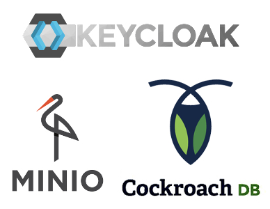

In this article we will introduce this stack. We will look into how to set them
up and how to test their resiliency across multi availability zone (AZ)
deployment.

 

(These 3 functionalities are what I usually use cloud for - definitely it does
not cover every possible use case out there [no A.I. service for example]. Of
course, I am thinking of extension - e.g. Vault to help manage certificates and
security, Kafka for resilient messaging , Consul for networking etc. - so maybe
a Keymico+ stack in the future)

 

### Only for cloud?

The great thing about the Keymico stack is that it doesn’t have to be cloud. If
all you have is a bunch of VMs (and a CDN) you can quickly setup a super
resilient cloud-like infra-structure - even for on premise applications. This is
especially true for people working in sensitive or regulated industry such as
the military, financial services or even health.

 

### Alternative

An alternative to this stack is the full force Open Stack
[<https://www.openstack.org/>]. I, personally, find Open Stack to be very
complete - and maybe that is why it seems a tad overwhelming to setup. Then
again, I would love to see a comparison between Open Stack and Keymico just for
the heck of it :)

 

Archictecture
-------------

In this article we will use a simple banking restful application (called
Keymicobank) that will be distributed to 3 VMs spread among 2 AZs.

 

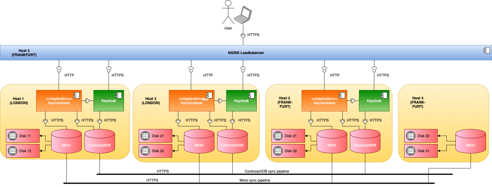

-   In this architecture, we will setup Minio, Keycloak and CockroachDB in 3 VMs
    in 2 different AZs. Minio will have a 4th VM in accordance to its minimal
    requirement

-   This is a test setup so we mix everything together in a single VM. In
    reality, you may want to separate your data and identity into different
    layers

-   Both CockhroachDB and Minio are sync across AZs so that data loss is
    minimised

-   We also mounted two disks per setup for Minio to use.

-   Keycloak is not setup as a cluster. Despite that, given that Keycloak’s
    database is highly available, Keycloak access is maintained even in the
    incident of an AZ failure.

-   All Keymico services are secured using self-signed TLS certificates. The
    application's (i.e. Keymico bank’s) services are secured at the Nginx load
    balancer level - also with a self-signed certificate

-   We emulate a CDN using an Nginx load balancer. Of course, in this test
    setup, if the single node load balancer fails then the whole setup fails. In
    reality, we would highly encourage the usage of CDN.

-   The Nginx load balancer is configured to round robin the requests to the
    applications. No session stickiness is expected as we assume data would
    always be sync between the database/object store nodes. In case of failure,
    Nginx will count the error up to maximum threshold, once exceeded, the
    server is considered unavailable and taken offline for an hour before retry.

 

Getting our hands dirty - Preliminary environment setup
-------------------------------------------------------

### What do we need

-   We would need 4 or 5 VMs, if possible internet facing for full effect (the
    VMs can be on a LAN, but, depending on your setup, you might not see the
    effect of multi-AZ failure test we are doing later)

    1.  3 VMs for our application + Keymico stack

    2.  1 VM for NGINX

    3.  Optionally, 1 VM for Jmeter to perform performance test (we can also run
        Jmeter on our laptop if we want)

-   Most of these commands should be the same across the VMs, so a tool like
    Ansible would definitely help. We will stick with plain bash for this
    article

-   Our VMs are Ubuntu based and therefore we will use Ubuntu specific command
    such as apt-get. You may want to find the equivalent command in your
    favourite OS

-   We will name (hostname) our VMs host1, host2 and host3. We will use plain
    old /etc/hosts for this. In reality, you may want to use proper DNS. We will
    put host1 and host3 in the same AZ and host2 in a different AZ all together.
    Please make sure that they can communicate with each other.

-   We will mount 2 disks per node for Minio to use. We name the disks diskN1
    and diskN2 with N designating the host number (e.g. host2 will have disk21
    and disk22). The disks are mounted on /mnt/diskN1 and /mnt/diskN2

-   We will also need SSH access to all hosts.

 

### Users for Host1, Host2 and Host3

Create users (notice the command to create user has a space in front of `sudo`
so that the command is not stored in bash history - you do not want people to
see the password by looking at history. Another - less automatable - option is
to take out `-p` and you will be prompt for a password):

-   cockroach

    ~~~~~~~~~~~~~~~~~~~~~~~~~~~~~~~~~~~~~~~~~~~~~~~~~~~~~~~~~~~~~~~~~~~~~~~~~~~~
    >  sudo useradd -m -p $(openssl passwd -crypt "<some password>") cockroach -s /bin/bash
    > sudo usermod -aG sudo cockroach
    ~~~~~~~~~~~~~~~~~~~~~~~~~~~~~~~~~~~~~~~~~~~~~~~~~~~~~~~~~~~~~~~~~~~~~~~~~~~~

-   minio

    ~~~~~~~~~~~~~~~~~~~~~~~~~~~~~~~~~~~~~~~~~~~~~~~~~~~~~~~~~~~~~~~~~~~~~~~~~~~~
    >  sudo useradd -m -p $(openssl passwd -crypt "<some password>") minio -s /bin/bash
    > sudo usermod -aG sudo minio
    ~~~~~~~~~~~~~~~~~~~~~~~~~~~~~~~~~~~~~~~~~~~~~~~~~~~~~~~~~~~~~~~~~~~~~~~~~~~~

-   keycloak

    ~~~~~~~~~~~~~~~~~~~~~~~~~~~~~~~~~~~~~~~~~~~~~~~~~~~~~~~~~~~~~~~~~~~~~~~~~~~~
    >  sudo useradd -m -p $(openssl passwd -crypt "<some password>") keycloak -s /bin/bash
    > sudo usermod -aG sudo keycloak
    ~~~~~~~~~~~~~~~~~~~~~~~~~~~~~~~~~~~~~~~~~~~~~~~~~~~~~~~~~~~~~~~~~~~~~~~~~~~~

-   azrulhasni (this is my name, you can use yours :) ) - this will be the main
    SSH user

    ~~~~~~~~~~~~~~~~~~~~~~~~~~~~~~~~~~~~~~~~~~~~~~~~~~~~~~~~~~~~~~~~~~~~~~~~~~~~
    >  sudo useradd -m -p $(openssl passwd -crypt "<some password>") azrulhasni -s /bin/bash
    > sudo usermod -aG sudo azrulhasni
    ~~~~~~~~~~~~~~~~~~~~~~~~~~~~~~~~~~~~~~~~~~~~~~~~~~~~~~~~~~~~~~~~~~~~~~~~~~~~

 

### Users for Host4

-   minio

    ~~~~~~~~~~~~~~~~~~~~~~~~~~~~~~~~~~~~~~~~~~~~~~~~~~~~~~~~~~~~~~~~~~~~~~~~~~~~
    >  sudo useradd -m -p $(openssl passwd -crypt "<some password>") minio -s /bin/bash
    > sudo usermod -aG sudo minio
    ~~~~~~~~~~~~~~~~~~~~~~~~~~~~~~~~~~~~~~~~~~~~~~~~~~~~~~~~~~~~~~~~~~~~~~~~~~~~

-   azrulhasni - this will be the main SSH user

    ~~~~~~~~~~~~~~~~~~~~~~~~~~~~~~~~~~~~~~~~~~~~~~~~~~~~~~~~~~~~~~~~~~~~~~~~~~~~
    >  sudo useradd -m -p $(openssl passwd -crypt "<some password>") azrulhasni -s /bin/bash
    > sudo usermod -aG sudo azrulhasni
    ~~~~~~~~~~~~~~~~~~~~~~~~~~~~~~~~~~~~~~~~~~~~~~~~~~~~~~~~~~~~~~~~~~~~~~~~~~~~

 

### User for Host 5

-   azrulhasni - this will be the main SSH user

    ~~~~~~~~~~~~~~~~~~~~~~~~~~~~~~~~~~~~~~~~~~~~~~~~~~~~~~~~~~~~~~~~~~~~~~~~~~~~
    >  sudo useradd -m -p $(openssl passwd -crypt "<some password>") azrulhasni -s /bin/bash
    > sudo usermod -aG sudo azrulhasni
    ~~~~~~~~~~~~~~~~~~~~~~~~~~~~~~~~~~~~~~~~~~~~~~~~~~~~~~~~~~~~~~~~~~~~~~~~~~~~

 

 

### Directory structure for Host1, Host2 and Host3

-   /opt : This is where we put Keycloak’s, Minio’s and CockroachDB’s binary
    files

-   /mnt/diskN1: Minio mounted disk1. N designates the host number

-   /mnt/diskN2: Minio mounted disk2. N designates the host number

-   /home/azrulhasni: Application binary and main user home directory

-   /home/cockroach: Cockroach user home directory

-   /home/cockroach/certs: Cockroach DB certificates directory

-   /home/cockroach/my-safe-directory: Cockroach DB CA key directory

-   /home/minio: Minio user home directory

-   /home/keycloak: Keycloak user home directory

 

### Directory structure for Host4

-   /opt : This is where we put Minio’s binary files

-   /mnt/diskN1: Minio mounted disk1. N designates the host number

-   /mnt/diskN2: Minio mounted disk2. N designates the host number

-   /home/azrulhasni: Application binary and main user home directory

-   /home/minio: Minio user home directory

 

### Directory structure for Host5

-   /home/azrulhasni: Application binary

 

### Outgoing ports open for all hosts

-   All ports

 

### Incoming ports open for Host1, Host2 and Host3

-   8080: CockroachDB admin portal

-   9000: Minio service port and admin portal

-   9443: Keycloak HTTPS service and admin portal

-   18080: Application service port

-   26257: CockroachDB service port

 

### Incoming ports open for Host4

-   9000: Minio service port and admin portal

 

### Incoming ports open for Host5

-   8443: NGINX HTTPS service port

 

### Host mapping for Host1, Host2 and Host3

-   Before we do this please note down the IP addresses (external facing) of
    Host1, Host2, Host3 and Host4

-   Open up the /etc/hosts file

~~~~~~~~~~~~~~~~~~~~~~~~~~~~~~~~~~~~~~~~~~~~~~~~~~~~~~~~~~~~~~~~~~~~~~~~~~~~~~~~
> sudo /etc/hosts
~~~~~~~~~~~~~~~~~~~~~~~~~~~~~~~~~~~~~~~~~~~~~~~~~~~~~~~~~~~~~~~~~~~~~~~~~~~~~~~~

-   Add the entries below

~~~~~~~~~~~~~~~~~~~~~~~~~~~~~~~~~~~~~~~~~~~~~~~~~~~~~~~~~~~~~~~~~~~~~~~~~~~~~~~~
<host4 ip address> host4
<host3 ip address> host3
<host2 ip address> host2
<host1 ip address> host1
127.0.0.1 keycloak
~~~~~~~~~~~~~~~~~~~~~~~~~~~~~~~~~~~~~~~~~~~~~~~~~~~~~~~~~~~~~~~~~~~~~~~~~~~~~~~~

-   Why is keycloak pointing to 127.0.0.1? We will explain that later

-   Alternatively, we can also use a DNS for all these entries

 

### Host mapping for Host4

-   Host4  has no Keycloak, the configuration is just a little bit different

-   Open up the /etc/hosts file

~~~~~~~~~~~~~~~~~~~~~~~~~~~~~~~~~~~~~~~~~~~~~~~~~~~~~~~~~~~~~~~~~~~~~~~~~~~~~~~~
> sudo /etc/hosts
~~~~~~~~~~~~~~~~~~~~~~~~~~~~~~~~~~~~~~~~~~~~~~~~~~~~~~~~~~~~~~~~~~~~~~~~~~~~~~~~

-   Add the entries below

~~~~~~~~~~~~~~~~~~~~~~~~~~~~~~~~~~~~~~~~~~~~~~~~~~~~~~~~~~~~~~~~~~~~~~~~~~~~~~~~
<host4 ip address> host4
<host3 ip address> host3
<host2 ip address> host2
<host1 ip address> host1
~~~~~~~~~~~~~~~~~~~~~~~~~~~~~~~~~~~~~~~~~~~~~~~~~~~~~~~~~~~~~~~~~~~~~~~~~~~~~~~~

-   Alternatively, we can also use a DNS for all these entries

 

### Host mapping for client

-   Open up the /etc/hosts file

~~~~~~~~~~~~~~~~~~~~~~~~~~~~~~~~~~~~~~~~~~~~~~~~~~~~~~~~~~~~~~~~~~~~~~~~~~~~~~~~
> sudo /etc/hosts
~~~~~~~~~~~~~~~~~~~~~~~~~~~~~~~~~~~~~~~~~~~~~~~~~~~~~~~~~~~~~~~~~~~~~~~~~~~~~~~~

-   Add the entries below

~~~~~~~~~~~~~~~~~~~~~~~~~~~~~~~~~~~~~~~~~~~~~~~~~~~~~~~~~~~~~~~~~~~~~~~~~~~~~~~~
<host4 ip address> host4
<host4 ip address> keycloak 
~~~~~~~~~~~~~~~~~~~~~~~~~~~~~~~~~~~~~~~~~~~~~~~~~~~~~~~~~~~~~~~~~~~~~~~~~~~~~~~~

-   Alternatively, we can also use a DNS for all these entries

 

Getting our hands dirty - Host1 setup
-------------------------------------

 

The following instructions is only for Host1

 

### Environment variables

The list below is the environment variables mainly for Host1.

~~~~~~~~~~~~~~~~~~~~~~~~~~~~~~~~~~~~~~~~~~~~~~~~~~~~~~~~~~~~~~~~~~~~~~~~~~~~~~~~
export CURRENT_WORKING_DIR=/home/azrulhasni

#-----------COCKROACHDB ENVIRONMENT VARIABLES---------------------
#-----------------------------------------------------------------

#Where to download CockroachDB
export COCKROACH_DOWNLOAD_URL=https://binaries.cockroachdb.com/cockroach-v20.2.5.linux-amd64.tgz
export COCKROACH_UNZIPED_DIR=cockroach-v20.2.5.linux-amd64

#The current host we are setting up
export HOST=host1 

#Other hosts for CockroachDB
export OTHER_HOSTS=host2,host3

#Name of CA cert file we will create for CockroachDB
export CA_CRT=ca.crt

#List of other access end point of Host 1
export NODE_ACCESS_LIST=10.106.0.2 46.101.1.218 host1 ubuntu-s-4vcpu-8gb-lon1-01 localhost 127.0.0.1 #space seperated hostname/ip address used to access host1

#We will create CockroachDB certs for other nodes in Host 1 itself. 
#So specifiy some info on those other nodes 
export OTHER_NODE1=host2
export OTHER_NODE1_CERT_FOLDER=/home/cockroach/certs2 
export OTHER_NODE1_ACCESS_LIST=10.106.0.4 46.101.52.93 host2 ubuntu-s-4vcpu-8gb-lon1-02 localhost 127.0.0.1 #space seperated hostname/ip

export OTHER_NODE2=host3
export OTHER_NODE2_CERT_FOLDER=/home/cockroach/certs3
export OTHER_NODE2_ACCESS_LIST=10.106.0.3 167.172.50.90 host3 ubuntu-s-4vcpu-8gb-lon1-03 localhost 127.0.0.1 #space seperated 

#-----------MINIO ENVIRONMENT VARIABLES---------------------
#-----------------------------------------------------------------

# --- Where to download Minio
export MINIO_DOWNLOAD_URL=https://dl.min.io/server/minio/release/linux-amd64/minio

#We will use the GO script below to generate certs for Minio
export GO_CERT_GENERATOR_URL=https://golang.org/src/crypto/tls/generate_cert.go?m=text

#Minio default users
export MINIO_USERNAME=minio-admin
 export MINIO_PASSWORD=1qazZAQ!

#Specify all minio server - we can use Minio expression language. 
#Spaces must be escaped
export MINIO_SERVERS=https://host1/mnt/data11\ https://host1/mnt/data12\ https://host2/mnt/data21\ https://host2/mnt/data22\ https://host3/mnt/data31\ https://host3/mnt/data32\ https://host4/mnt/data41\ https://host4/mnt/data42 

#Disk name for this host
export DISK1=data11
export DISK2=data12

#-----------KEYCLOAK ENVIRONMENT VARIABLES---------------------
#-----------------------------------------------------------------

#Where to download Keycloak
export KEYCLOAK_URL=https://github.com/keycloak/keycloak/releases/download/12.0.3/keycloak-12.0.3.tar.gz
export KEYCLOAK_UNZIPED_DIR=keycloak-12.0.3

#Postgresql JDBC jar download URL
export POSTGRESQL_JDBC_DOWNLOAD_URL=https://jdbc.postgresql.org/download/postgresql-42.2.19.jar

#Postgresql JDBC jar
export POSTGRESQL_JDBC_JAR=postgresql-42.2.18.jar

export POSTGRESQL_JDBC_URL='jdbc:postgresql:\/\/host1:26257\/keycloakdb' 
#!!!-this url must be escaped - use https://dwaves.de/tools/escape/
~~~~~~~~~~~~~~~~~~~~~~~~~~~~~~~~~~~~~~~~~~~~~~~~~~~~~~~~~~~~~~~~~~~~~~~~~~~~~~~~

 

 

### CockroachDB setup

-   The instructions below came from CockroachDB
    website[<https://www.cockroachlabs.com/docs/v20.2/install-cockroachdb-linux>].
    You may want to visit the site for your platform specific setup.

-   We opt for the basic production topology
    [<https://www.cockroachlabs.com/docs/v20.2/topology-basic-production.html>]
    where all data is replicated to all nodes. Unfortunately, the VM provider we
    are using doesn’t really have AZ in the region of our choosing - so we opt
    for something out of the region and yet still configure CockroachDB to
    replicate everywhere - this seems to work (possibly because the regions we
    choose (LONDON and FRANKFURT) isn’t all that far from each other) but not
    recommended. In reality, if we are replicating data across region, we want
    to opt for a geo-based topology, e.g.
    [<https://www.cockroachlabs.com/docs/v20.2/topology-geo-partitioned-replicas.html>]

-   Download CockroachDB

~~~~~~~~~~~~~~~~~~~~~~~~~~~~~~~~~~~~~~~~~~~~~~~~~~~~~~~~~~~~~~~~~~~~~~~~~~~~~~~~
> sudo mkdir /opt/$COCKROACH_UNZIPED_DIR
wget -c $COCKROACH_DOWNLOAD_URL -O - | tar -xzv --strip-components=1 -C /opt/$COCKROACH_UNZIPED_DIR

> sudo ln /opt/$COCKROACH_UNZIPED_DIR/cockroach /usr/local/bin/cockroach
~~~~~~~~~~~~~~~~~~~~~~~~~~~~~~~~~~~~~~~~~~~~~~~~~~~~~~~~~~~~~~~~~~~~~~~~~~~~~~~~

-   Create certificate for Host1

~~~~~~~~~~~~~~~~~~~~~~~~~~~~~~~~~~~~~~~~~~~~~~~~~~~~~~~~~~~~~~~~~~~~~~~~~~~~~~~~
> sudo mkdir /home/cockroach/certs

> sudo mkdir /home/cockroach/my-safe-directory

> sudo cockroach cert create-ca \
--certs-dir=/home/cockroach/certs \
--ca-key=/home/cockroach/my-safe-directory/ca.key

> sudo cockroach cert create-node \
$NODE_ACCESS_LIST \
--certs-dir=/home/cockroach/certs \
--ca-key=/home/cockroach/my-safe-directory/ca.key

> sudo chown -R cockroach:cockroach /home/cockroach/certs
> sudo chown -R cockroach:cockroach /home/cockroach/my-safe-directory

> sudo chmod 700 /home/cockroach/certs/node.crt
> sudo chmod 700 /home/cockroach/certs/node.key
> sudo chmod 700 /home/cockroach/certs/$CA_CRT
~~~~~~~~~~~~~~~~~~~~~~~~~~~~~~~~~~~~~~~~~~~~~~~~~~~~~~~~~~~~~~~~~~~~~~~~~~~~~~~~

-   In Host1, we will create CockroachDB certificates for other nodes (Host2 and
    Host3)

~~~~~~~~~~~~~~~~~~~~~~~~~~~~~~~~~~~~~~~~~~~~~~~~~~~~~~~~~~~~~~~~~~~~~~~~~~~~~~~~
> sudo mkdir $OTHER_NODE1_CERT_FOLDER
> sudo mkdir $OTHER_NODE2_CERT_FOLDER

> sudo cockroach cert create-node \
$OTHER_NODE1_ACCESS_LIST \
--certs-dir=$OTHER_NODE1_CERT_FOLDER \
--ca-key=/home/cockroach/my-safe-directory/ca.key

> sudo mv $OTHER_NODE1_CERT_FOLDER/node.key $OTHER_NODE1_CERT_FOLDER/node.$OTHER_NODE1.key
> sudo mv $OTHER_NODE1_CERT_FOLDER/node.crt $OTHER_NODE1_CERT_FOLDER/node.$OTHER_NODE1.crt

> sudo cockroach cert create-node \
$OTHER_NODE2_ACCESS_LIST \
--certs-dir=$OTHER_NODE2_CERT_FOLDER \
--ca-key=/home/cockroach/my-safe-directory/ca.key
> sudo mv $OTHER_NODE2_CERT_FOLDER/node.key $OTHER_NODE2_CERT_FOLDER/node.$OTHER_NODE2.key
> sudo mv $OTHER_NODE2_CERT_FOLDER/node.crt $OTHER_NODE2_CERT_FOLDER/node.$OTHER_NODE2.crt

> sudo chown -R cockroach:cockroach $OTHER_NODE1_CERT_FOLDER
> sudo chown -R cockroach:cockroach $OTHER_NODE2_CERT_FOLDER
~~~~~~~~~~~~~~~~~~~~~~~~~~~~~~~~~~~~~~~~~~~~~~~~~~~~~~~~~~~~~~~~~~~~~~~~~~~~~~~~

-   Next, copy the files below to /home/azrulhasni on Host2 and Host3

    1.  /home/cockroach/ca.crt

1.  /home/cockroach/certs2/node.host2.crt

2.  /home/cockroach/certs2/node.host2.crt

3.  /home/cockroach/certs3/node.host3.crt

4.  /home/cockroach/certs3/node.host3.crt

-   We will then create a configuration file for systemd so that we can start
    and stop CockroachDB easily

~~~~~~~~~~~~~~~~~~~~~~~~~~~~~~~~~~~~~~~~~~~~~~~~~~~~~~~~~~~~~~~~~~~~~~~~~~~~~~~~
 #--setup systemd
> sudo cat << EOF | tee -a /etc/systemd/system/cockroach.service
[Unit]
Description=Cockroach Database cluster node
Requires=network.target

[Service]
Type=simple
WorkingDirectory=/home/cockroach
ExecStartPre=/bin/sleep 30
ExecStart=/usr/local/bin/cockroach start --certs-dir=/home/cockroach/certs --host=$HOST --http-host=$HOST --join=$HOST,$OTHER_HOSTS --cache=25% --max-sql-memory=25%
ExecStop=/usr/local/bin/cockroach quit --certs-dir=/home/cockroach/certs --host=$HOST
Restart=always
RestartSec=10
RestartPreventExitStatus=0
StandardOutput=syslog
StandardError=syslog
SyslogIdentifier=cockroach
User=cockroach

[Install]
WantedBy=default.target
EOF
~~~~~~~~~~~~~~~~~~~~~~~~~~~~~~~~~~~~~~~~~~~~~~~~~~~~~~~~~~~~~~~~~~~~~~~~~~~~~~~~

-   Complete systemd setup and start the CockroachDB service

~~~~~~~~~~~~~~~~~~~~~~~~~~~~~~~~~~~~~~~~~~~~~~~~~~~~~~~~~~~~~~~~~~~~~~~~~~~~~~~~
> sudo systemctl daemon-reload
> sudo systemctl enable cockroach
> sudo systemctl start cockroach
~~~~~~~~~~~~~~~~~~~~~~~~~~~~~~~~~~~~~~~~~~~~~~~~~~~~~~~~~~~~~~~~~~~~~~~~~~~~~~~~

-   To see the status of CockroachDB, run

~~~~~~~~~~~~~~~~~~~~~~~~~~~~~~~~~~~~~~~~~~~~~~~~~~~~~~~~~~~~~~~~~~~~~~~~~~~~~~~~
> sudo systemctl status cockroach
~~~~~~~~~~~~~~~~~~~~~~~~~~~~~~~~~~~~~~~~~~~~~~~~~~~~~~~~~~~~~~~~~~~~~~~~~~~~~~~~

-   Since Host1 is the first host, we need to initialize CokcroachDB

~~~~~~~~~~~~~~~~~~~~~~~~~~~~~~~~~~~~~~~~~~~~~~~~~~~~~~~~~~~~~~~~~~~~~~~~~~~~~~~~
> sudo cockroach init --certs-dir=/home/cockroach/certs --host=$HOST1
~~~~~~~~~~~~~~~~~~~~~~~~~~~~~~~~~~~~~~~~~~~~~~~~~~~~~~~~~~~~~~~~~~~~~~~~~~~~~~~~

-   Then, create certificates for our banking user and keycloak user

~~~~~~~~~~~~~~~~~~~~~~~~~~~~~~~~~~~~~~~~~~~~~~~~~~~~~~~~~~~~~~~~~~~~~~~~~~~~~~~~
> sudo cockroach cert create-client \
    banking \
    --certs-dir=/home/cockroach/certs \
    --ca-key=/home/cockroach/my-safe-directory/ca.key
> sudo cockroach cert create-client \
    keycloak \
    --certs-dir=/home/cockroach/certs \
    --ca-key=/home/cockroach/my-safe-directory/ca.key
~~~~~~~~~~~~~~~~~~~~~~~~~~~~~~~~~~~~~~~~~~~~~~~~~~~~~~~~~~~~~~~~~~~~~~~~~~~~~~~~

-   Copy the certificates created in /home/cockroach/certs to /home/azrulhasni
    of Host2 and Host3

 

### Creating databases

-   First, let us log in to the database and create the users

~~~~~~~~~~~~~~~~~~~~~~~~~~~~~~~~~~~~~~~~~~~~~~~~~~~~~~~~~~~~~~~~~~~~~~~~~~~~~~~~
> cockroach sql --certs-dir=certs --host=localhost:26257
~~~~~~~~~~~~~~~~~~~~~~~~~~~~~~~~~~~~~~~~~~~~~~~~~~~~~~~~~~~~~~~~~~~~~~~~~~~~~~~~

-   We will get the CockroachDB client. Use it to create users and databases. We
    will create `keycloakdb` as Keycloak database and `keycloak` as Keycloak
    database user. We will also create a database named `banking` for our
    application under the user named `banking`

~~~~~~~~~~~~~~~~~~~~~~~~~~~~~~~~~~~~~~~~~~~~~~~~~~~~~~~~~~~~~~~~~~~~~~~~~~~~~~~~
root@:26257/defaultdb> CREATE USER banking WITH LOGIN PASSWORD 'somepassword'

root@:26257/defaultdb> CREATE USER keycloak WITH LOGIN PASSWORD 'somepassword'

root@:26257/defaultdb> CREATE DATABASE banking

root@:26257/defaultdb> CREATE DATABASE keycloakdb

root@:26257/defaultdb> alter database banking owner to banking

root@:26257/defaultdb> alter database keycloakdb owner to keycloak

root@:26257/defaultdb> exit
~~~~~~~~~~~~~~~~~~~~~~~~~~~~~~~~~~~~~~~~~~~~~~~~~~~~~~~~~~~~~~~~~~~~~~~~~~~~~~~~

### Installing JDK 

Let us install the JDK

~~~~~~~~~~~~~~~~~~~~~~~~~~~~~~~~~~~~~~~~~~~~~~~~~~~~~~~~~~~~~~~~~~~~~~~~~~~~~~~~
> sudo apt-get update
> sudo apt-get install openjdk-11-jdk
~~~~~~~~~~~~~~~~~~~~~~~~~~~~~~~~~~~~~~~~~~~~~~~~~~~~~~~~~~~~~~~~~~~~~~~~~~~~~~~~

 

### Keycloak database setup

-   Recall our architecture where Keycloak will use CockroachDB as a database.
    CockroachDB is PostgreSQL compatible so, in theory , this should not be a
    problem

-   Unfortunately, one problem we encounter is when running Keycloak the first
    time. Keycloak will try to create tables (if the tables do not exit yet in
    CockroachDB) - but this leads to error

-   To mitigate this, we install Keycloak with PostgreSQL and export the table
    structure and preliminary data of Keycloak out. We then load these exported
    structure and data to CockroachDB.

-   Download the 3 SQL files to
    Host1:<https://github.com/azrulhasni/keymico/blob/main/keycloak/keycloak_create_no_constraints.sql>

    <https://github.com/azrulhasni/keymico/blob/main/keycloak/keycloak_data.sql>

    <https://github.com/azrulhasni/keymico/blob/main/keycloak/keycloak_add_constraints.sql>

-   Load Keycloak tables and data to CockroachDB. Note: it is important to load
    CockroachDB is the order of 1) tables 2) data 3) constraints

~~~~~~~~~~~~~~~~~~~~~~~~~~~~~~~~~~~~~~~~~~~~~~~~~~~~~~~~~~~~~~~~~~~~~~~~~~~~~~~~
> cockroach sql --database=keycloakdb < keycloak_create_no_constraints.sql
~~~~~~~~~~~~~~~~~~~~~~~~~~~~~~~~~~~~~~~~~~~~~~~~~~~~~~~~~~~~~~~~~~~~~~~~~~~~~~~~

~~~~~~~~~~~~~~~~~~~~~~~~~~~~~~~~~~~~~~~~~~~~~~~~~~~~~~~~~~~~~~~~~~~~~~~~~~~~~~~~
> cockroach sql --database=keycloakdb < keycloak_data.sql
~~~~~~~~~~~~~~~~~~~~~~~~~~~~~~~~~~~~~~~~~~~~~~~~~~~~~~~~~~~~~~~~~~~~~~~~~~~~~~~~

~~~~~~~~~~~~~~~~~~~~~~~~~~~~~~~~~~~~~~~~~~~~~~~~~~~~~~~~~~~~~~~~~~~~~~~~~~~~~~~~
> cockroach sql --database=keycloakdb < keycloak_add_constraints.sql
~~~~~~~~~~~~~~~~~~~~~~~~~~~~~~~~~~~~~~~~~~~~~~~~~~~~~~~~~~~~~~~~~~~~~~~~~~~~~~~~

 

### Add Keycloak database certificate to JVM

-   Keycloak will need to call CockroachDB. Unfortunately, we CockroachDB is
    protected by a self-signed TLS. Because of this, we need to import
    CockroachDB certificate to our JVM keystore (cacerts) so that Keycloak
    (which runs on said JVM) will recognise the self-signed certificate used by
    CockroachDB

~~~~~~~~~~~~~~~~~~~~~~~~~~~~~~~~~~~~~~~~~~~~~~~~~~~~~~~~~~~~~~~~~~~~~~~~~~~~~~~~
> export CACERTS_LOC=/usr/lib/jvm/java-11-openjdk-amd64/lib/security/cacerts
~~~~~~~~~~~~~~~~~~~~~~~~~~~~~~~~~~~~~~~~~~~~~~~~~~~~~~~~~~~~~~~~~~~~~~~~~~~~~~~~

~~~~~~~~~~~~~~~~~~~~~~~~~~~~~~~~~~~~~~~~~~~~~~~~~~~~~~~~~~~~~~~~~~~~~~~~~~~~~~~~
> sudo openssl s_client -connect $HOST:26257 </dev/null     | sudo sed -ne '/-BEGIN CERTIFICATE-/,/-END CERTIFICATE-/p' > cockroach.$HOST.cer
~~~~~~~~~~~~~~~~~~~~~~~~~~~~~~~~~~~~~~~~~~~~~~~~~~~~~~~~~~~~~~~~~~~~~~~~~~~~~~~~

~~~~~~~~~~~~~~~~~~~~~~~~~~~~~~~~~~~~~~~~~~~~~~~~~~~~~~~~~~~~~~~~~~~~~~~~~~~~~~~~
> sudo keytool -noprompt -import -file "/tmp/cockroach.localhost.cer" -keystore "$CACERTS_LOC" -alias "cockroachdb" -storepass  changeit
~~~~~~~~~~~~~~~~~~~~~~~~~~~~~~~~~~~~~~~~~~~~~~~~~~~~~~~~~~~~~~~~~~~~~~~~~~~~~~~~

-   The default cacerts password is “change” as used above. Do change it if you
    are using some other password

 

### Keycloak issuer URL - a discussion

This discussion is to explain the logic behind some of the configuration we
have. It can be skipped if all we want is to get up and running quickly

The way Keycloak handles issuer URI is a bit particular that it merits a
discussion.

Note: the scheme discussed here is when Keycloak is configured with Password
Grant authorisation flow

Note: the diagram below shows direct client connectivity to application and
Keycloak for simplicity purposes. In our architecture, we have a load-balancer
between the client and application+Keycloak. The concept presented below still
holds either with direct connection or connection through load-balancer. The
configuration to /etc/hosts on the client side will still need to be done

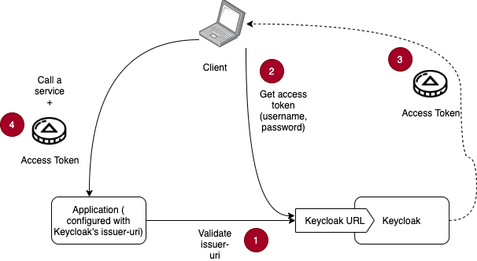

1) When our application starts, it will call Keycloak to make sure that the
issuer-url in its configuration file is correct and valid. If the issuer-url is
not correct, the application will not start properly

2) A client calls Keycloak with a username and password.

3) Keycloak will return back an access token. **The access token contains
Keycloak URL**

4) The client then calls our application and provide the access token as a proof
that it is an authenticated client. Our application will take the Keycloak URL
from the access token and compare it with its own validated issuer-url. If this
is equal, then the token is correct.

 

The problem comes when we run Keycloak in the same VM as the application. We may
put the issuer-url as localhost, but the Keycloak URL used by the client is
different (for Host1 it would be host1). Obviously localhost does not equal
host1 - and therefore - that is why, in Host1, Host2 and Host3, we need to have
an entry called keycloak 127.0.0.1 in /etc/hosts. This is so that we can use the
domain name ‘keycloak’ instead of ‘localhost’. From the client side, we also
need to map ‘keycloak’ to Host1 IP address (or the load balancer IP address -
rather).

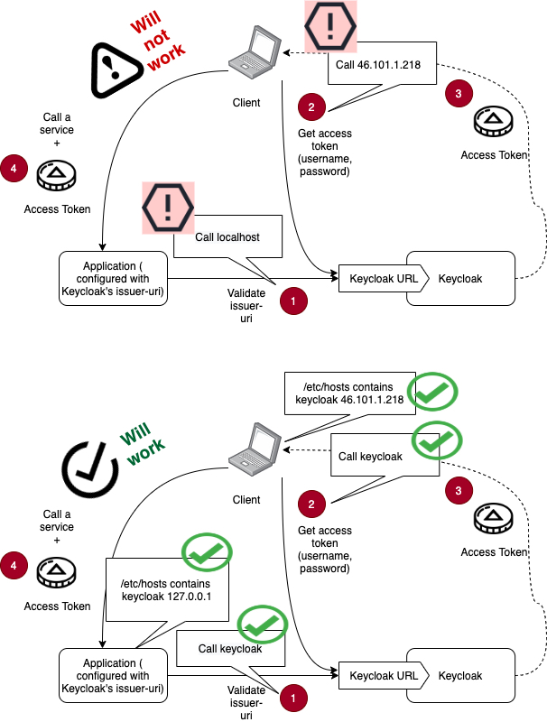

 

 

### Setting up Keycloak

-   Now we are ready to setup Keycloak

-   First, let us download it

~~~~~~~~~~~~~~~~~~~~~~~~~~~~~~~~~~~~~~~~~~~~~~~~~~~~~~~~~~~~~~~~~~~~~~~~~~~~~~~~
> sudo mkdir /opt/$KEYCLOAK_UNZIPED_DIR
> sudo wget -c $KEYCLOAK_URL -O - | tar -xzv --strip-components=1 -C /opt/$KEYCLOAK_UNZIPED_DIR

> sudo chown -R keycloak:keycloak /opt/$KEYCLOAK_UNZIPED_DIR
~~~~~~~~~~~~~~~~~~~~~~~~~~~~~~~~~~~~~~~~~~~~~~~~~~~~~~~~~~~~~~~~~~~~~~~~~~~~~~~~

-   Next, let us download PostgreSQL JDBC jar file

~~~~~~~~~~~~~~~~~~~~~~~~~~~~~~~~~~~~~~~~~~~~~~~~~~~~~~~~~~~~~~~~~~~~~~~~~~~~~~~~
> sudo wget -c $POSTGRESQL_JDBC_DOWNLOAD_URL -O - | tar -xzv --strip-components=1 -C $CURRENT_WORKING_DIR
~~~~~~~~~~~~~~~~~~~~~~~~~~~~~~~~~~~~~~~~~~~~~~~~~~~~~~~~~~~~~~~~~~~~~~~~~~~~~~~~

-   Let us put in the needed configuration. To help with this, we prepared a
    template file

-   <https://github.com/azrulhasni/keymico/blob/main/keycloak/standalone.proto.xml>.
    Download the file and place it in /home/azrulhasni

-   Run the command below to setup this configuration

~~~~~~~~~~~~~~~~~~~~~~~~~~~~~~~~~~~~~~~~~~~~~~~~~~~~~~~~~~~~~~~~~~~~~~~~~~~~~~~~
sudo cp $CURRENT_WORKING_DIR/standalone.proto.xml /opt/$KEYCLOAK_UNZIPED_DIR/standalone/configuration
sudo rm /opt/$KEYCLOAK_UNZIPED_DIR/standalone/configuration/standalone.xml
sudo mv /opt/$KEYCLOAK_UNZIPED_DIR/standalone/configuration/standalone.proto.xml /opt/$KEYCLOAK_UNZIPED_DIR/standalone/configuration/standalone.xml

#--update standalone xml for jdbc url
sudo sed -i -e "s/YYY_JDBC_URL_YYY/$POSTGRESQL_JDBC_URL/g" /opt/$KEYCLOAK_UNZIPED_DIR/standalone/configuration/standalone.xml

#--update standalone xml for self signed cert creation
sudo sed -i -e "s/<keystore path=\"application\.keystore\" relative-to=\"jboss\.server\.config\.dir\" keystore-password=\"password\" alias=\"server\" key-password=\"password\" generate-self-signed-certificate-host=\"localhost\"\/>/<keystore path=\"application\.keystore\" relative-to=\"jboss\.server\.config\.dir\" keystore-password=\"password\" alias=\"keycloak\" key-password=\"password\" generate-self-signed-certificate-host=\"keycloak\"\/>/g" /opt/$KEYCLOAK_UNZIPED_DIR/standalone/configuration/standalone.xml

sudo mkdir -p /opt/$KEYCLOAK_UNZIPED_DIR/modules/system/layers/keycloak/org/postgresql/main
sudo cp $CURRENT_WORKING_DIR/$POSTGRESQL_JDBC_JAR /opt/$KEYCLOAK_UNZIPED_DIR/modules/system/layers/keycloak/org/postgresql/main

#----put JDBC jar in Keycloak
sudo cat << EOF | tee -a /opt/$KEYCLOAK_UNZIPED_DIR/modules/system/layers/keycloak/org/postgresql/main/module.xml
<?xml version="1.0" ?>
<module xmlns="urn:jboss:module:1.3" name="org.postgresql">

    <resources>
        <resource-root path="$POSTGRESQL_JDBC_JAR"/>
    </resources>

    <dependencies>
        <module name="javax.api"/>
        <module name="javax.transaction.api"/>
    </dependencies>
</module>
EOF

sudo chown -R keycloak:keycloak /opt/$KEYCLOAK_UNZIPED_DIR/modules/system/layers/keycloak/org/postgresql
~~~~~~~~~~~~~~~~~~~~~~~~~~~~~~~~~~~~~~~~~~~~~~~~~~~~~~~~~~~~~~~~~~~~~~~~~~~~~~~~

-   The command above will do a few things, firstly it will update the JDBC URL
    in Keycloak to point to CockroachDB

-   Secondly, it will replace the original self-signed certificate generator
    host (originally, this points to localhost) to ‘keycloak’ - please refer to
    the discussion is the paragraph "Keycloak issuer URL - a discussion” for
    clarification. Note that Keycloak is interesting because it can
    auto-generate a self-signed certificate. We just need to put the right
    configuration to take advantage of this

-   Thirdly, it will copy our JDBC jar file downloaded above to Keycloak and
    update Keycloak’s database configuration to use said JDBC jar

 

### Add service to systemd and start Keycloak

We want to easily start and stop Keycloak. So, we create a service in systemd
for that

~~~~~~~~~~~~~~~~~~~~~~~~~~~~~~~~~~~~~~~~~~~~~~~~~~~~~~~~~~~~~~~~~~~~~~~~~~~~~~~~
#----declare Keycloak in systemd-------------
sudo cat > /etc/systemd/system/keycloak.service <<EOF

[Unit]
Description=Keycloak
After=network.target

[Service]
Type=idle
User=keycloak
Group=keycloak
ExecStart=/opt/$KEYCLOAK_UNZIPED_DIR/bin/standalone.sh -Djboss.socket.binding.port-offset=1000 -b=0.0.0.0
TimeoutStartSec=600
TimeoutStopSec=600

[Install]
WantedBy=multi-user.target
EOF

#---run keycloak in systemd------
sudo systemctl daemon-reload
sudo systemctl enable keycloak
sudo systemctl start keycloak
sudo systemctl status keycloak
~~~~~~~~~~~~~~~~~~~~~~~~~~~~~~~~~~~~~~~~~~~~~~~~~~~~~~~~~~~~~~~~~~~~~~~~~~~~~~~~

If all goes well, Keycloak will be started and we can use it right away.

 

### Setting up Keycloak realm, client and user

-   Access Keycloak’s administrator portal at https://host4:9080/auth. If you
    used the sql files we provided above the administrator login is admin with
    password abbc123. We advise that you change the password immediately.

-   To add a realm, under Master realm, click ‘Add Realm’. Then create a realm
    called ‘banking’. Click ‘Create’ - and we are done. Keycloak will bring us
    automatically to the Banking realm

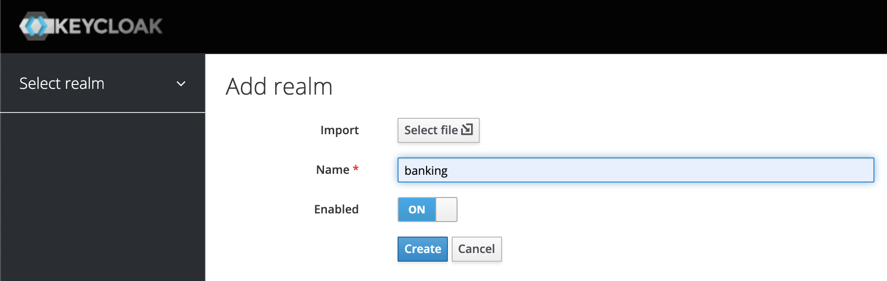

-   To create a client, on the side menu, click Client, on the right side, click
    Create button. We will get a form. In Client ID, enter bankingclient, and
    click on Save

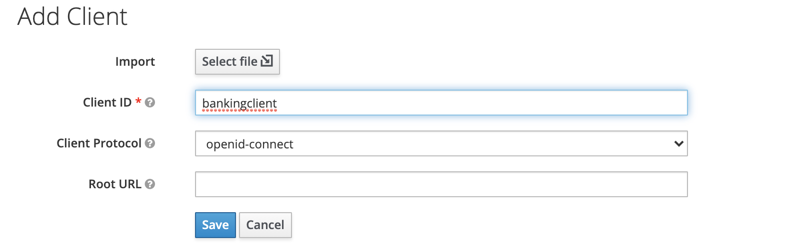

-   Once saved, the form will expand. Fill it as per below

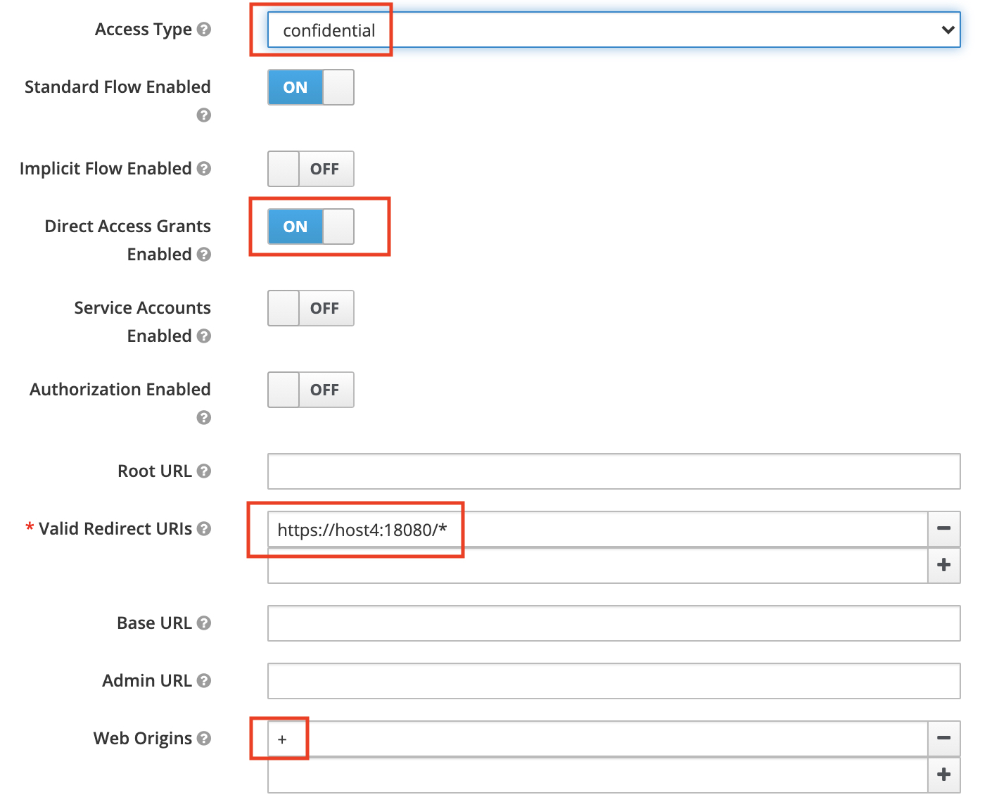

-   At the bottom of the form, find Advanced Setting and open it. Set the access
    token lifespan to 120 minutes. Note: this setting is for testing purposes
    only. We do not want our access token to expire while we are testing later.
    In reality, an access token is short lived based on our own requirement.

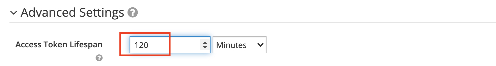

-   Then click on Save button at the bottom of the page and navibgate back up,
    and click on the Confidential tab. Note the client secret. We are now done
    with setting up a Keycloak client

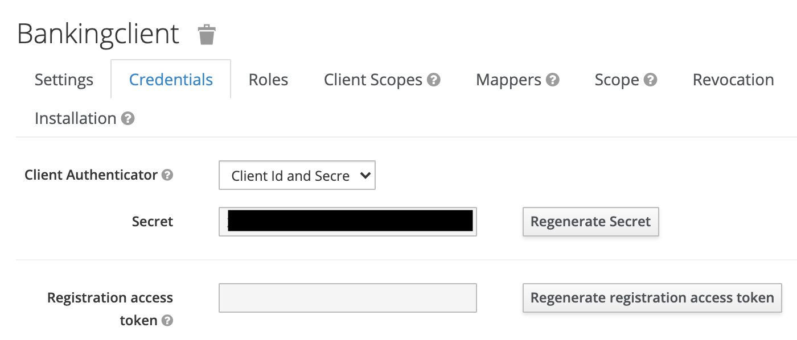

-   To create a user, on the side menu, click Users, on the right hand side,
    click Add User button

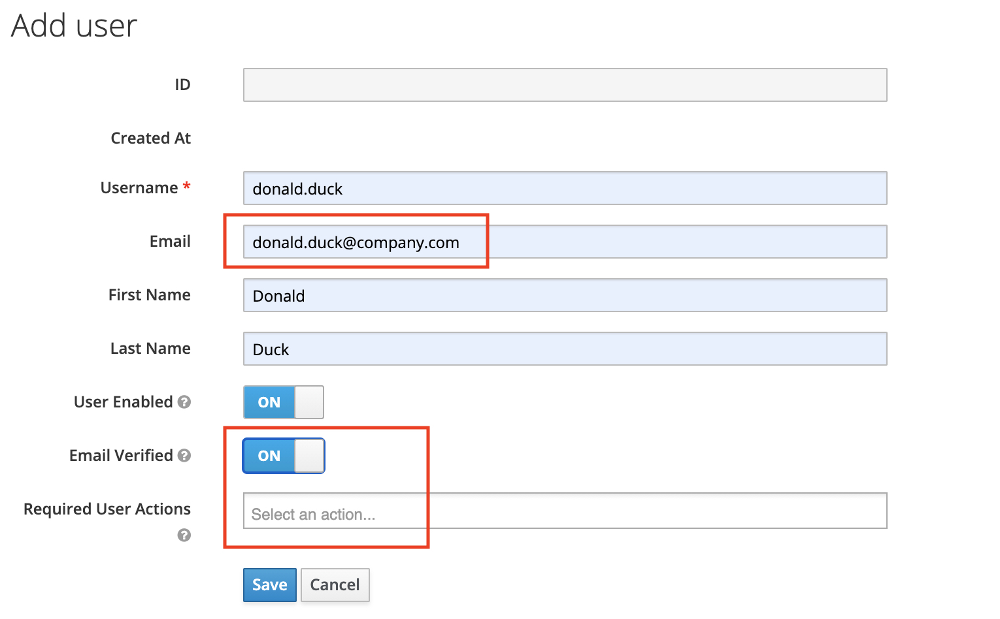

 

-   Make sure email is filled in (even if it is not compulsory), the Email
    Verified is set to ON and Required User Actions is left empty. Click on
    Save. The form will refresh. Go to the top and choose the tab Credentials

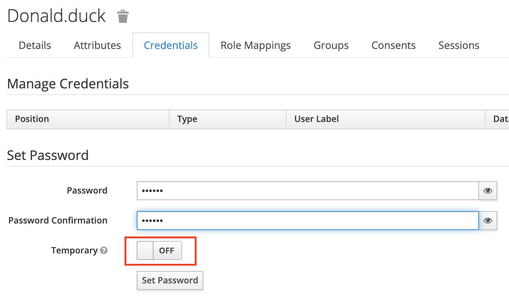

-   In the Password and Password Confirmation, put in the password for the user.
    Make sure Temporary is turned OFF. Click on Set Password

-   We are now done with creating a user

 

### Setting up Minio

-   We will use a go script to create self-signed certificate for Minio.
    Firstly, let us install Go

~~~~~~~~~~~~~~~~~~~~~~~~~~~~~~~~~~~~~~~~~~~~~~~~~~~~~~~~~~~~~~~~~~~~~~~~~~~~~~~~
> sudo apt-get update
> sudo apt-get install golang
~~~~~~~~~~~~~~~~~~~~~~~~~~~~~~~~~~~~~~~~~~~~~~~~~~~~~~~~~~~~~~~~~~~~~~~~~~~~~~~~

 

-   Next, we would like to create a bunch of self-signed certificate for all 4
    minio hosts

~~~~~~~~~~~~~~~~~~~~~~~~~~~~~~~~~~~~~~~~~~~~~~~~~~~~~~~~~~~~~~~~~~~~~~~~~~~~~~~~
> sudo mkdir -p /home/minio/.minio/certs/CAs

> sudo wget -c $GO_CERT_GENERATOR_URL -O - | tar -xzv --strip-components=1 -C /home/minio/ #Download the Go certificate generator

> sudo go run generate_cert.go -ca --host "$HOST1"
> sudo mv /home/minio/cert.pem /home/minio/.minio/certs/public.crt
> sudo mv /home/minio/key.pem  /home/minio/.minio/certs/private.key
> sudo cp /home/minio/.minio/certs/public.crt /home/minio/
> sudo mv /home/minio/public.crt /home/minio/public1.crt 

> sudo go run generate_cert.go -ca --host "$HOST2"
> sudo mv /home/minio/cert.pem /home/minio/.minio/certs/public2.crt
> sudo cp /home/minio/.minio/certs/public2.crt /home/minio/
> sudo mv /home/minio/key.pem  /home/minio/private2.key 
> sudo cp /home/minio/.minio/certs/private2.key  /home/minio/

> sudo go run generate_cert.go -ca --host "$HOST3"
> sudo mv /home/minio/cert.pem /home/minio/.minio/certs/public3.crt
> sudo cp /home/minio/.minio/certs/public3.crt /home/minio/
> sudo mv /home/minio/key.pem  /home/minio/private3.key 
> sudo cp /home/minio/.minio/certs/private3.key  /home/minio/

> sudo go run generate_cert.go -ca --host "$HOST4"
> sudo mv /home/minio/cert.pem /home/minio/.minio/certs/public4.crt
> sudo cp /home/minio/.minio/certs/public4.crt /home/minio/
> sudo mv /home/minio/key.pem  /home/minio/private4.key 
> sudo cp /home/minio/.minio/certs/private4.key  /home/minio/

> sudo chown -R minio:minio /home/minio/.minio
~~~~~~~~~~~~~~~~~~~~~~~~~~~~~~~~~~~~~~~~~~~~~~~~~~~~~~~~~~~~~~~~~~~~~~~~~~~~~~~~

 

-   Copy the 7 files below  from /home/minio to Host2, Host3 and Host4. Put the
    files under /home/azrulhasni in respective hosts

1.  public1.crt

2.  public2.crt

3.  private2.key

4.  public3.crt

5.  private3.key

6.  public4.crt

7.  private4.key

 

-   Then download Minio

~~~~~~~~~~~~~~~~~~~~~~~~~~~~~~~~~~~~~~~~~~~~~~~~~~~~~~~~~~~~~~~~~~~~~~~~~~~~~~~~
> sudo curl $MINIO_DOWNLOAD_URL \
  --create-dirs \
  -o /opt/minio-binaries/minio

> sudo chmod +x /opt/minio-binaries/minio

> sudo ln /opt/minio-binaries/minio /usr/local/bin/minio
~~~~~~~~~~~~~~~~~~~~~~~~~~~~~~~~~~~~~~~~~~~~~~~~~~~~~~~~~~~~~~~~~~~~~~~~~~~~~~~~

 

-   Set ownership of disks

~~~~~~~~~~~~~~~~~~~~~~~~~~~~~~~~~~~~~~~~~~~~~~~~~~~~~~~~~~~~~~~~~~~~~~~~~~~~~~~~
#--For disks----
> sudo chown -R minio /mnt/$DISK1
> sudo chmod u+rxw /mnt/$DISK1
> sudo chown -R minio /mnt/$DISK2
> sudo chmod u+rxw /mnt/$DISK2
~~~~~~~~~~~~~~~~~~~~~~~~~~~~~~~~~~~~~~~~~~~~~~~~~~~~~~~~~~~~~~~~~~~~~~~~~~~~~~~~

 

-   Configure Minio’s default information

~~~~~~~~~~~~~~~~~~~~~~~~~~~~~~~~~~~~~~~~~~~~~~~~~~~~~~~~~~~~~~~~~~~~~~~~~~~~~~~~
#---MINIO default info
sudo cat << EOF | tee -a  /etc/default/minio
MINIO_ACCESS_KEY=$MINIO_USERNAME
MINIO_SECRET_KEY=$MINIO_PASSWORD
MINIO_VOLUMES=$MINIO_SERVERS
EOF
~~~~~~~~~~~~~~~~~~~~~~~~~~~~~~~~~~~~~~~~~~~~~~~~~~~~~~~~~~~~~~~~~~~~~~~~~~~~~~~~

 

-   Last but not least, we set up a systemd service to allow us to easily start
    and stop Minio

~~~~~~~~~~~~~~~~~~~~~~~~~~~~~~~~~~~~~~~~~~~~~~~~~~~~~~~~~~~~~~~~~~~~~~~~~~~~~~~~
#-----Systemd config
sudo cat << EOF | tee -a /etc/systemd/system/minio.service
[Unit]
Description=MinIO
Documentation=https://docs.min.io
Wants=network-online.target
After=network-online.target
AssertFileIsExecutable=/usr/local/bin/minio

[Service]
WorkingDirectory=/home/minio

User=minio
Group=minio

EnvironmentFile=/etc/default/minio
ExecStartPre=/bin/bash -c "if [ -z \"\${MINIO_VOLUMES}\" ]; then echo \"Variable MINIO_VOLUMES not set in /etc/default/minio\"; exit 1; fi"

ExecStart=/usr/local/bin/minio server \$MINIO_OPTS \$MINIO_VOLUMES

# Let systemd restart this service always
Restart=always

# Specifies the maximum file descriptor number that can be opened by this process
LimitNOFILE=65536

# Specifies the maximum number of threads this process can create
TasksMax=infinity

# Disable timeout logic and wait until process is stopped
TimeoutStopSec=infinity
SendSIGKILL=no

[Install]
WantedBy=multi-user.target

EOF

#---Run-------------
> sudo systemctl daemon-reload
> sudo systemctl enable minio
> sudo systemctl start minio
> sudo systemctl status minio
~~~~~~~~~~~~~~~~~~~~~~~~~~~~~~~~~~~~~~~~~~~~~~~~~~~~~~~~~~~~~~~~~~~~~~~~~~~~~~~~

 

-   if all goes well, Minio should be up and running

-   Congratulations! We have set up our first host.

 

Getting our hands dirty - Host2 and Host3 setup
-----------------------------------------------

 

### Setup files

Recall that we created a few files in Host1 to be transferred to Host2 and
Host3. Make sure they are transferred to /home/azrulhasni of Host2 and Host3

1.  ca.crt

2.  node.host1.crt

3.  node.host2.crt

4.  node.host2.key

5.  node.host3.crt

6.  node.host3.key

7.  private2.key

8.  private3.key

9.  private4.key

10. public1.crt

11. public2.crt

12. public3.crt

13. public4.crt

14. standalone.proto.xml

 

### Environment variables for Host2

~~~~~~~~~~~~~~~~~~~~~~~~~~~~~~~~~~~~~~~~~~~~~~~~~~~~~~~~~~~~~~~~~~~~~~~~~~~~~~~~
export CURRENT_WORKING_DIR=/home/azrulhasni

export COCKROACH_DOWNLOAD_URL=https://binaries.cockroachdb.com/cockroach-v20.2.5.linux-amd64.tgz
export COCKROACH_UNZIPED_DIR=cockroach-v20.2.5.linux-amd64
export HOST=host2
export OTHER_HOSTS=host1,host3

export CA_CRT=ca.crt
export NODE_CRT=node.host2.crt
export NODE_KEY=node.host2.key

export MINIO_DOWNLOAD_URL=https://dl.min.io/server/minio/release/linux-amd64/minio
export MINIO_USERNAME=minio-admin
export MINIO_PASSWORD=1qazZAQ!
export MINIO_SERVERS=https://host1/mnt/data11\ https://host1/mnt/data12\ https://host2/mnt/data21\ https://host2/mnt/data22\ https://host3/mnt/data31\ https://host3/mnt/data32\ https://host4/mnt/data41\ https://host4/mnt/data42 #spaces must be excaped

export DISK1=data21
export DISK2=data22
export MINIO_PUBLIC_CERT=public2.crt
export MINIO_PRIVATE_KEY=private2.key

export OTHER_MINIO_PUBLIC_CERT1=public1.crt
export OTHER_MINIO_PRIVATE_KEY1=private1.key

export OTHER_MINIO_PUBLIC_CERT2=public3.crt
export OTHER_MINIO_PRIVATE_KEY2=private3.key

export OTHER_MINIO_PUBLIC_CERT3=public4.crt
export OTHER_MINIO_PRIVATE_KEY3=private4.key

export KEYCLOAK_URL=https://github.com/keycloak/keycloak/releases/download/12.0.3/keycloak-12.0.3.tar.gz
export KEYCLOAK_UNZIPED_DIR=keycloak-12.0.3
export POSTGRESQL_JDBC_DOWNLOAD_URL=https://jdbc.postgresql.org/download/postgresql-42.2.19.jar
export POSTGRESQL_JDBC_JAR=postgresql-42.2.18.jar
export POSTGRESQL_JDBC_URL='jdbc:postgresql:\/\/host2:26257\/keycloakdb'
~~~~~~~~~~~~~~~~~~~~~~~~~~~~~~~~~~~~~~~~~~~~~~~~~~~~~~~~~~~~~~~~~~~~~~~~~~~~~~~~

 

### Environment variables for Host3

~~~~~~~~~~~~~~~~~~~~~~~~~~~~~~~~~~~~~~~~~~~~~~~~~~~~~~~~~~~~~~~~~~~~~~~~~~~~~~~~
export CURRENT_WORKING_DIR=/home/azrulhasni

export COCKROACH_DOWNLOAD_URL=https://binaries.cockroachdb.com/cockroach-v20.2.5.linux-amd64.tgz
export COCKROACH_UNZIPED_DIR=cockroach-v20.2.5.linux-amd64
export HOST=host3
export OTHER_HOSTS=host1,host2

export CA_CRT=ca.crt
export NODE_CRT=node.host3.crt
export NODE_KEY=node.host3.key

export MINIO_DOWNLOAD_URL=https://dl.min.io/server/minio/release/linux-amd64/minio
export MINIO_USERNAME=minio-admin
export MINIO_PASSWORD=1qazZAQ!
export MINIO_SERVERS=https://host1/mnt/data11\ https://host1/mnt/data12\ https://host2/mnt/data21\ https://host2/mnt/data22\ https://host3/mnt/data31\ https://host3/mnt/data32\ https://host4/mnt/data41\ https://host4/mnt/data42 #spaces must be excaped

export DISK1=data31
export DISK2=data32
export MINIO_PUBLIC_CERT=public3.crt
export MINIO_PRIVATE_KEY=private3.key

export OTHER_MINIO_PUBLIC_CERT1=public1.crt
export OTHER_MINIO_PRIVATE_KEY1=private1.key

export OTHER_MINIO_PUBLIC_CERT2=public2.crt
export OTHER_MINIO_PRIVATE_KEY2=private2.key

export OTHER_MINIO_PUBLIC_CERT3=public4.crt
export OTHER_MINIO_PRIVATE_KEY3=private4.key

export KEYCLOAK_URL=https://github.com/keycloak/keycloak/releases/download/12.0.3/keycloak-12.0.3.tar.gz
export KEYCLOAK_UNZIPED_DIR=keycloak-12.0.3
export POSTGRESQL_JDBC_DOWNLOAD_URL=https://jdbc.postgresql.org/download/postgresql-42.2.19.jar
export POSTGRESQL_JDBC_JAR=postgresql-42.2.18.jar
export POSTGRESQL_JDBC_URL='jdbc:postgresql:\/\/host3:26257\/keycloakdb'
~~~~~~~~~~~~~~~~~~~~~~~~~~~~~~~~~~~~~~~~~~~~~~~~~~~~~~~~~~~~~~~~~~~~~~~~~~~~~~~~
